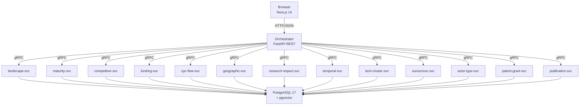

# TI-Radar -- Technology Intelligence Radar

**Aktuelle Version:** v3.4.0 (2026-04-14) -- siehe [docs/testing/ergebnisse/konsistenz/FIX_REPORT.md](docs/testing/ergebnisse/konsistenz/FIX_REPORT.md) fuer die in dieser Version behobenen 12 Konsistenz-Bugs.

Webbasierte Analyseplattform fuer Technologie-Intelligence auf Basis von Patent- und Forschungsdaten. Das System integriert 5 Datenquellen -- EPO DOCDB (154.8M Patente), CORDIS (80.5K EU-Forschungsprojekte), OpenAIRE (Publikationen), Semantic Scholar (Zitationsanalyse) und GLEIF (Legal Entity Identifier) -- und stellt diese ueber 13 analytische Use Cases (UC1-UC13) als interaktives Dashboard bereit.

Entstanden im Rahmen einer Bachelorarbeit an der HWR Berlin.

## Architektur



## Metriken-Konsistenz (ab v3.4.0)

Alle UC-uebergreifend verwendeten Kennzahlen (Publikationen, Akteure, Patente, Reifegrad-Konfidenz, vollstaendige Jahre) sind zentral in `packages/shared/domain/` definiert und strukturell vor Divergenzen geschuetzt:

- `publication_definitions.py` -- `PublicationScope` (CORDIS_LINKED | OPENAIRE_MATCHED | SEMANTIC_SCHOLAR_TOP)
- `actor_definitions.py` -- `ActorScope` (ACTIVE_IN_WINDOW | CLUSTER_MEMBER | CLASSIFIED)
- `patent_definitions.py` -- `PatentScope` (ALL_PATENTS | APPLICATIONS_ONLY | GRANTS_ONLY) + `APPLICATION_KIND_CODES`/`GRANT_KIND_CODES`
- `year_completeness.py` -- `last_complete_year()` als Single-Source-of-Truth fuer Zeitreihen-Endjahre
- `metrics.py` -- `s_curve_confidence()` mit strukturellem R²-Gate (`R² < 0.5 → Konfidenz 0`)

Protobuf-Feld `fit_reliability_flag` in `uc2_maturity.proto` erlaubt dem Frontend, unzuverlaessige S-Kurven-Fits explizit zu markieren.

## Voraussetzungen

| Komponente | Version | Hinweis |
|---|---|---|
| Docker Desktop | >= 4.x | inkl. Docker Compose Plugin |
| RAM | >= 16 GB | empfohlen (PostgreSQL nutzt bis zu 8 GB) |
| Festplattenspeicher | >= 5 GB | Docker-Images + Demo-Datenbank. Für Vollimport (EPO + CORDIS): ~400 GB |
| EPO API Key | optional | für Live-Patent-Abfragen (kostenlose Registrierung) |

## Schnellstart

```bash
# 1. Repository klonen
git clone https://github.com/KingdaKilla/TI-Radarv3.0.git
cd TI-Radarv3.0

# 2. Umgebungskonfiguration erstellen
cp .env.example .env

# 3. POSTGRES_PASSWORD in .env setzen (einziger Pflicht-Wert):
#    POSTGRES_PASSWORD=mein_sicheres_passwort

# 4. Stack starten (baut Images automatisch beim ersten Mal)
docker compose -f deploy/docker-compose.yml --env-file .env up -d

# 5. Warten bis alle Services healthy sind (~1-2 Minuten)
docker compose -f deploy/docker-compose.yml --env-file .env ps

# 6. Im Browser öffnen
#    Frontend:  http://localhost:3000
#    API Docs:  http://localhost:8000/docs
```

Beim ersten Start wird automatisch das Datenbankschema angelegt und CORDIS-Demodaten geladen (~6.000 Patente, ~5.000 Projekte, ~18.000 Publikationen). Das System ist sofort nutzbar — kein manueller Datenimport noetig.

> **Troubleshooting:** Falls Services nicht starten, prüfen mit `docker compose -f deploy/docker-compose.yml --env-file .env logs <service-name>`. Häufigste Ursache: `POSTGRES_PASSWORD` nicht gesetzt.

## Projektstruktur

| Verzeichnis | Beschreibung |
|---|---|
| `frontend/` | Next.js 14 Frontend (TypeScript, Recharts, D3, Tailwind) |
| `services/` | 16 Python-Microservices + 1 Next.js-Frontend (13 UC-Services + Orchestrator + Import + Export) |
| `packages/shared/` | Geteilter Python-Code (Domain-Ports, Protobuf-Stubs) |
| `proto/` | Protobuf-Definitionen für gRPC-Kommunikation |
| `database/` | SQL-Schema-Migrationen, Mock-Daten |
| `deploy/` | Docker Compose, Makefile, Monitoring-Infrastruktur (Prometheus, Grafana) |
| `scripts/` | Setup-, Start- und Proto-Generierungsskripte |
| `tests/` | Contract-, Integrations- und Validierungstests |
| `docs/` | Architekturdokumentation |

## Entwicklung

Alle Build-Befehle werden aus dem `deploy/`-Verzeichnis via Make ausgeführt:

```bash
cd deploy

# gRPC Python-Stubs aus proto/ generieren
make proto

# Ruff + Mypy auf alle Services ausführen
make lint

# Pytest auf alle Services ausführen
make test

# Docker-Images bauen
make docker

# Stack starten / stoppen
make up
make down

# Logs folgen
make logs
```

## CI/CD

Das Projekt nutzt **6 GitHub Actions Workflows**:

| Workflow | Beschreibung |
|---|---|
| Backend CI | Lint + Unit-Tests für alle Python-Services |
| Frontend CI | Build + Lint des Next.js-Frontends |
| Proto CI | Protobuf-Kompilierung und Kompatibilitätsprüfung |
| Docker Build | Bau aller 18 Docker-Images (17 Services + 1 DB) |
| Integration Tests | End-to-End-Tests gegen den laufenden Stack |
| PR Quality Gate | Zusammenfassung aller Checks als Merge-Voraussetzung |

Docker-Images werden in der **GitHub Container Registry** (`ghcr.io`) publiziert. Secrets (Datenbankpasswörter, API-Keys) werden über **GitHub Actions Secrets** verwaltet.

**Testabdeckung:** 836+ Tests (407 Shared-Domain + 356 Service + 84 Integration).

## Daten & Caching

- **Auto-Seeding:** Beim ersten Start werden automatisch CORDIS-Demodaten (4.815 Projekte, 4.034 Organisationen, 17.900 Publikationen) geladen.
- **5 Datenquellen:** EPO DOCDB (Bulk-Import), CORDIS (Bulk-Import), OpenAIRE (Live-API, 7d TTL), Semantic Scholar (Live-API, 30d TTL), GLEIF (Live-API, 90d TTL).
- **API-Caching:** Externe API-Antworten werden in der Datenbank gecacht mit Stale-Fallback bei API-Ausfaellen.
- **Woechentlicher Import-Scheduler:** APScheduler im Import-Service fuehrt jeden Sonntag 02:00 UTC einen vollstaendigen Datenimport durch (konfigurierbar).
- **GLEIF LEI Integration:** Actor-Type-Service (UC11) reichert Organisationen ueber die kostenlose GLEIF API mit Legal Entity Identifiern an.
- **Export-Formate:** CSV, XLSX, JSON und PDF (WIPO-konformer Report mit Matplotlib-Charts).

## Dokumentation

- [Architektur](docs/ARCHITEKTUR.md) -- Systemübersicht, Clean Architecture, Service-Kommunikation
- [Datenmodell](docs/DATENMODELL.md) -- Datenbankschemas, Datenquellen, ER-Diagramm
- [Deployment](docs/DEPLOYMENT.md) -- Vollständige Setup-Anleitung, Monitoring
- [API](docs/API.md) -- REST-Endpunkte, Request/Response-Beispiele, Fehlerbehandlung

## Lizenz

MIT -- siehe [LICENSE](LICENSE).
