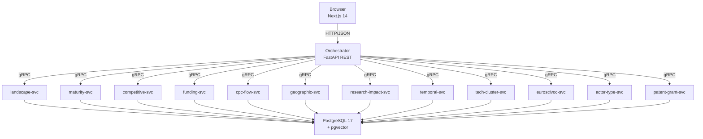

# TI-Radar -- Technology Intelligence Radar

Webbasierte Analyseplattform für Technologie-Intelligence auf Basis von Patent- und Forschungsdaten. Das System aggregiert Daten aus dem Europäischen Patentamt (EPO, 154.8M Patente), CORDIS (80.5K EU-Forschungsprojekte) und OpenAIRE (Publikationen) und stellt diese über 13 analytische Use Cases (UC1–UC12 + UC-C Publications) als interaktives Dashboard bereit.

Entstanden im Rahmen einer Bachelorarbeit an der HWR Berlin.

## Architektur



## Voraussetzungen

| Komponente | Version | Hinweis |
|---|---|---|
| Docker Desktop | >= 4.x | inkl. Docker Compose Plugin |
| Festplattenspeicher | >= 400 GB | Datenbank (~300 GB) + Docker-Images + Wachstumspuffer |
| EPO API Key | optional | für Live-Patent-Abfragen (kostenlose Registrierung) |

Das gesamte Projekt (Code, Datenbank, Konfiguration) wird an **einem Ort** gespeichert. Ein externes Laufwerk ist nicht mehr erforderlich -- die PostgreSQL-Daten liegen im Docker-Volume am selben Speicherort wie das Repository.

## Schnellstart

```bash
# 1. Repository klonen
git clone https://github.com/KingdaKilla/TI-Radarv3.0.git
cd TI-Radarv3.0

# 2. Umgebungskonfiguration erstellen
cp .env.example .env

# 3. Pflicht-Wert in .env eintragen:
#    - POSTGRES_PASSWORD (sicheres Passwort wählen)

# 4. Stack starten (baut Images automatisch beim ersten Mal)
docker compose -f deploy/docker-compose.yml --env-file .env up -d

# 5. Im Browser öffnen
#    Frontend:  http://localhost:3000
#    API Docs:  http://localhost:8000/docs
```

Beim ersten Start wird automatisch das Datenbankschema angelegt und CORDIS-Demodaten geladen. Das System ist sofort nutzbar.

## Projektstruktur

| Verzeichnis | Beschreibung |
|---|---|
| `frontend/` | Next.js 14 Frontend (TypeScript, Recharts, D3, Tailwind) |
| `services/` | 15 Python-Microservices + 1 Next.js-Frontend (12 UC-Services + Orchestrator + Import + Export + Publication) |
| `packages/shared/` | Geteilter Python-Code (Domain-Ports, Protobuf-Stubs) |
| `proto/` | Protobuf-Definitionen für gRPC-Kommunikation |
| `database/` | SQL-Schema-Migrationen, Mock-Daten |
| `deploy/` | Docker Compose, Makefile, Monitoring-Infrastruktur (Prometheus, Grafana) |
| `scripts/` | Setup-, Start- und Proto-Generierungsskripte |
| `tests/` | Contract-, Integrations- und Validierungstests |
| `docs/` | Architekturdokumentation |

## Entwicklung

Alle Build-Befehle werden aus dem `deploy/`-Verzeichnis via Make ausgeführt:

```bash
cd deploy

# gRPC Python-Stubs aus proto/ generieren
make proto

# Ruff + Mypy auf alle Services ausführen
make lint

# Pytest auf alle Services ausführen
make test

# Docker-Images bauen
make docker

# Stack starten / stoppen
make up
make down

# Logs folgen
make logs
```

## CI/CD

Das Projekt nutzt **6 GitHub Actions Workflows**:

| Workflow | Beschreibung |
|---|---|
| Backend CI | Lint + Unit-Tests für alle Python-Services |
| Frontend CI | Build + Lint des Next.js-Frontends |
| Proto CI | Protobuf-Kompilierung und Kompatibilitätsprüfung |
| Docker Build | Bau aller Docker-Images |
| Integration Tests | End-to-End-Tests gegen den laufenden Stack |
| PR Quality Gate | Zusammenfassung aller Checks als Merge-Voraussetzung |

Docker-Images werden in der **GitHub Container Registry** (`ghcr.io`) publiziert. Secrets (Datenbankpasswörter, API-Keys) werden über **GitHub Actions Secrets** verwaltet.

**Testabdeckung:** 836+ Tests (407 Shared-Domain + 356 Service + 84 Integration).

## Daten & Caching

- **Auto-Seeding:** Beim ersten Start werden automatisch CORDIS-Demodaten (4.815 Projekte, 4.034 Organisationen, 17.900 Publikationen) geladen.
- **API-Caching:** OpenAIRE- und Semantic-Scholar-Antworten werden in der Datenbank gecacht (7 bzw. 30 Tage TTL).

## Dokumentation

- [Architektur](docs/ARCHITEKTUR.md) -- Systemübersicht, Clean Architecture, Service-Kommunikation
- [Datenmodell](docs/DATENMODELL.md) -- Datenbankschemas, Datenquellen, ER-Diagramm
- [Deployment](docs/DEPLOYMENT.md) -- Vollständige Setup-Anleitung, externes Laufwerk, Monitoring
- [API](docs/API.md) -- REST-Endpunkte, Request/Response-Beispiele, Fehlerbehandlung

## Lizenz

MIT -- siehe [LICENSE](LICENSE).
