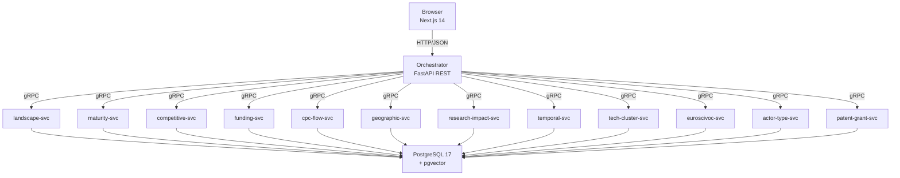

# TI-Radar -- Technology Intelligence Radar

Webbasierte Analyseplattform für Technologie-Intelligence auf Basis von Patent- und Forschungsdaten. Das System aggregiert Daten aus dem Europäischen Patentamt (EPO, 154.8M Patente), CORDIS (80.5K EU-Forschungsprojekte) und OpenAIRE (Publikationen) und stellt diese über 12 analytische Use Cases als interaktives Dashboard bereit.

Entstanden im Rahmen einer Bachelorarbeit an der HWR Berlin.

## Architektur



## Voraussetzungen

| Komponente | Version | Hinweis |
|---|---|---|
| Docker Desktop | >= 4.x | inkl. Docker Compose Plugin |
| Externes Laufwerk | >= 600 GB | für PostgreSQL-Datenverzeichnis |
| EPO API Key | optional | für Live-Patent-Abfragen (kostenlose Registrierung) |

## Schnellstart

```bash
# 1. Repository klonen
git clone https://github.com/<org>/ti-radar.git
cd ti-radar

# 2. Umgebungskonfiguration erstellen
cp .env.example .env

# 3. Pflicht-Werte in .env eintragen:
#    - POSTGRES_PASSWORD (sicheres Passwort wählen)
#    - TI_RADAR_DB_PATH  (z.B. D:/ti-radar-db oder /mnt/external/ti-radar-db)

# 4. Setup ausführen (Docker-Images bauen, Proto-Stubs generieren)
bash scripts/setup.sh

# 5. Stack starten
bash scripts/start.sh

# 6. Im Browser öffnen
#    Frontend:  http://localhost:3000
#    API Docs:  http://localhost:8000/docs
```

## Projektstruktur

| Verzeichnis | Beschreibung |
|---|---|
| `frontend/` | Next.js 14 Frontend (TypeScript, Recharts, D3, Tailwind) |
| `services/` | 16 Python-Microservices (12 UC-Services + Orchestrator + Import + Export + Publication) |
| `packages/shared/` | Geteilter Python-Code (Domain-Ports, Protobuf-Stubs) |
| `proto/` | Protobuf-Definitionen für gRPC-Kommunikation |
| `database/` | SQL-Schema-Migrationen, Mock-Daten |
| `deploy/` | Docker Compose, Makefile, Monitoring-Infrastruktur (Prometheus, Grafana) |
| `scripts/` | Setup-, Start- und Proto-Generierungsskripte |
| `tests/` | Contract-, Integrations- und Validierungstests |
| `docs/` | Architekturdokumentation |

## Entwicklung

Alle Build-Befehle werden aus dem `deploy/`-Verzeichnis via Make ausgeführt:

```bash
cd deploy

# gRPC Python-Stubs aus proto/ generieren
make proto

# Ruff + Mypy auf alle Services ausführen
make lint

# Pytest auf alle Services ausführen
make test

# Docker-Images bauen
make docker

# Stack starten / stoppen
make up
make down

# Logs folgen
make logs
```

## Dokumentation

- [Architektur](docs/ARCHITEKTUR.md) -- Systemübersicht, Clean Architecture, Service-Kommunikation
- [Datenmodell](docs/DATENMODELL.md) -- Datenbankschemas, Datenquellen, ER-Diagramm
- [Deployment](docs/DEPLOYMENT.md) -- Vollständige Setup-Anleitung, externes Laufwerk, Monitoring
- [API](docs/API.md) -- REST-Endpunkte, Request/Response-Beispiele, Fehlerbehandlung

## Lizenz

MIT -- siehe [LICENSE](LICENSE).
