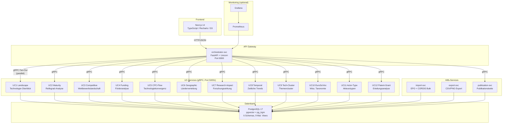

# Architektur

## Systemübersicht

TI-Radar ist als Microservice-Architektur mit 15 Python-Microservices + 1 Next.js-Frontend (16 Services gesamt) aufgebaut. Das Next.js-Frontend kommuniziert über REST/JSON mit einem FastAPI-Orchestrator, der Anfragen parallel via gRPC an 12 spezialisierte Use-Case-Services verteilt. Alle Services greifen auf eine gemeinsame PostgreSQL-17-Datenbank zu.



## Clean Architecture

Jeder UC-Service folgt einer dreischichtigen Architektur (Hexagonal / Ports-and-Adapters):

```
service.py          gRPC-Adapter (dünner Wrapper)
    |
    v
use_case.py         Business-Logik (reine Domänlogik, framework-unabhängig)
    |
    v
mappers/            Protobuf-zu-Dict- und Dict-zu-Response-Konvertierung
```

### Schicht 1: service.py (gRPC-Adapter)

- Implementiert das gRPC-Servicer-Interface (generiert aus `.proto`)
- Empfängt `AnalysisRequest`, delegiert an `use_case.py`
- Keine Business-Logik, nur Protokoll-Übersetzung

### Schicht 2: use_case.py (Business-Logik)

- Framework-unabhängige Domänlogik
- Erhält typisierte Parameter, gibt typisierte Result-Objekte zurück
- Greift über Port-Interfaces (ABCs in `shared/domain/ports`) auf Repositories zu
- CAGR-Berechnung, Normalisierung, Aggregation

### Schicht 3: mappers/ (Konvertierung)

- `proto_mapper.py`: Protobuf-Nachrichten zu Domain-Objekten
- `response_mapper.py`: Domain-Objekte zu Protobuf-Responses
- CAGR-Normalisierung (Division durch 100) erfolgt in der Mapper-Schicht

### Konventionen

- **Repository-Rückgabewerte:** Alle Repositories geben frozen slotted Dataclasses zurück. Zugriff immer per Attribut (`.year`, `.count`), nie per Dict-Subscript (`["year"]`).
- **Port-Interfaces:** Definiert in `packages/shared/domain/ports/` als abstrakte Basisklassen (ABCs).
- **Protobuf-Stubs:** Generiert via `scripts/generate_protos.sh` in `packages/shared/generated/python/`.

## Service-Kommunikation

### Intern: gRPC

- Alle 12 UC-Services exponieren Port `50051`
- Protobuf-Definitionen in `proto/` (je eine `.proto`-Datei pro UC + `common.proto`)
- Gemeinsamer `AnalysisRequest` (Technologie, Zeitraum, Filter)
- Pro-UC-spezifische Response-Typen

### Extern: REST/JSON

- Orchestrator exponiert FastAPI auf Port `8000`
- Haupt-Endpunkt: `POST /api/v1/radar` -- ruft alle 13 UC-Services parallel auf
- Graceful Degradation: fehlgeschlagene UCs liefern leere Panels + Warnungen
- Per-UC-Timeout-Konfiguration
- Rate Limiting (100 Requests/Minute pro IP)

### Fan-Out-Muster

```
Browser --POST--> Orchestrator --+--> gRPC UC1  --+
                                 +--> gRPC UC2  --+
                                 +--> gRPC UC3  --+--> Aggregation --> JSON Response
                                 +--> ...       --+
                                 +--> gRPC UC12 --+
```

Der Orchestrator nutzt `asyncio.gather` mit `return_exceptions=True` für parallelen Fan-Out. Jeder UC-Aufruf hat einen eigenen Timeout. Bei Fehlern werden betroffene Panels als leer markiert und der Fehler in `uc_errors` gemeldet.

## Frontend-Architektur

| Technologie | Einsatz |
|---|---|
| Next.js 14 | Framework (App Router) |
| TypeScript | Typsicherheit |
| Recharts | Balken-, Linien-, Flächendiagramme |
| Nivo | AreaBump-Diagramme (UC8 Temporal) |
| D3.js | Spezialvisualisierungen |
| Tailwind CSS | Styling |
| Zod | Runtime-Validierung der API-Responses (13 Schemas) |

### Frontend-Konventionen

- **Formatierung:** Zentrale Funktionen in `utils/format.ts` (`formatEur`, `formatPercent`, `formatNumber`), immer Locale `de-DE`
- **CAGR-Pipeline:** Backend liefert Fraktion (0-1), Frontend multipliziert mit 100 via `formatPercent`
- **Transform-Layer:** `lib/transform.ts` enthält pro UC eine dedizierte `transformX()`-Funktion
- **PanelCard:** Nutzt `resolvedKey` (Fallback ucKey -> ucNumber) für Tooltips, Datenquellen-Footer und Confidence-Badge

## Use Cases

| UC | Service | Beschreibung |
|---|---|---|
| UC1 | landscape-svc | Technologie-Überblick: Patent- und Projektvolumen, CAGR, Top-Akteure |
| UC2 | maturity-svc | Reifegrad-Analyse nach Gao et al. (2013): S-Kurve, Patentfamilien |
| UC3 | competitive-svc | Wettbewerbslandschaft: Marktkonzentration (HHI), Top-Anmelder |
| UC4 | funding-svc | EU-Förderanalyse: Förderinstrumente, Budgetverteilung |
| UC5 | cpc-flow-svc | CPC-Technologiekonvergenz: Jaccard-Kookkurrenz zwischen CPC-Klassen |
| UC6 | geographic-svc | Geographische Verteilung: Länder, Regionen |
| UC7 | research-impact-svc | Forschungswirkung: Zitationsanalyse, h-Index, Semantic Scholar |
| UC8 | temporal-svc | Zeitliche Trends: Emerging/Declining Technologies |
| UC9 | tech-cluster-svc | Themencluster: NLP-basierte Gruppierung von Patenten |
| UC10 | euroscivoc-svc | EuroSciVoc-Taxonomie: Wissenschaftliche Klassifikation |
| UC11 | actor-type-svc | Akteurstypen: Unternehmen, Hochschulen, Forschungseinrichtungen |
| UC12 | patent-grant-svc | Erteilungsanalyse: Time-to-Grant, Erteilungsquoten |
| UC-C | publication-svc | Publikationskette: CORDIS-Publikationen, Open Access |

## CI/CD-Pipeline

Docker-Images werden über GitHub Actions automatisch gebaut und in die GitHub Container Registry (`ghcr.io/kingdakilla/ti-radar-*`) publiziert. Der Workflow wird durch Versionstags (`v*`) ausgelöst und baut alle Service-Images parallel. Secrets (API-Keys, Datenbank-Passwörter) werden über GitHub Actions Secrets injiziert.

## API-Caching-Schicht

Für externe APIs (OpenAIRE, Semantic Scholar) existiert eine datenbankgestützte Caching-Schicht, um Rate-Limits einzuhalten und Antwortzeiten zu minimieren:

| API | Cache-Tabelle | TTL |
|---|---|---|
| OpenAIRE | `research_schema.openaire_cache` | 7 Tage |
| Semantic Scholar | `research_schema.papers` | 30 Tage |

Bei Cache-Hits wird die gespeicherte Antwort direkt zurückgegeben. Abgelaufene Einträge werden bei der nächsten Abfrage transparent aktualisiert.
