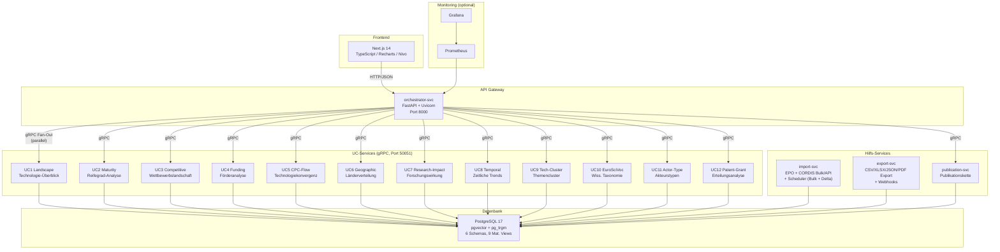

# Architektur

## Systemübersicht

TI-Radar ist als Microservice-Architektur mit 16 Python-Services + 1 Next.js-Frontend (17 Services gesamt) aufgebaut. Das Next.js-Frontend kommuniziert über REST/JSON mit einem FastAPI-Orchestrator, der Anfragen parallel via gRPC an 13 spezialisierte Use-Case-Services (UC1-UC12 + UC-C Publication) verteilt. Alle Services greifen auf eine gemeinsame PostgreSQL-17-Datenbank zu.



## Clean Architecture

Jeder UC-Service folgt einer dreischichtigen Architektur (Hexagonal / Ports-and-Adapters):

```
service.py          gRPC-Adapter (dünner Wrapper)
    |
    v
use_case.py         Business-Logik (reine Domänlogik, framework-unabhängig)
    |
    v
mappers/            Protobuf-zu-Dict- und Dict-zu-Response-Konvertierung
```

### Schicht 1: service.py (gRPC-Adapter)

- Implementiert das gRPC-Servicer-Interface (generiert aus `.proto`)
- Empfängt `AnalysisRequest`, delegiert an `use_case.py`
- Keine Business-Logik, nur Protokoll-Übersetzung

### Schicht 2: use_case.py (Business-Logik)

- Framework-unabhängige Domänlogik
- Erhält typisierte Parameter, gibt typisierte Result-Objekte zurück
- Greift über Port-Interfaces (ABCs in `shared/domain/ports`) auf Repositories zu
- CAGR-Berechnung, Normalisierung, Aggregation

### Schicht 3: mappers/ (Konvertierung)

- `protobuf.py`: Domain-Objekte zu Protobuf-Responses
- `dict_response.py`: Fallback-Konvertierung zu Dict, wenn Protobuf-Stubs nicht verfügbar
- CAGR-Normalisierung (Division durch 100) erfolgt in der Mapper-Schicht

### Konventionen

- **Repository-Rückgabewerte:** Alle Repositories geben frozen slotted Dataclasses zurück. Zugriff immer per Attribut (`.year`, `.count`), nie per Dict-Subscript (`["year"]`).
- **Port-Interfaces:** Definiert in `packages/shared/domain/ports/` als abstrakte Basisklassen (ABCs).
- **Protobuf-Stubs:** Generiert in `packages/shared/generated/python/` (Build-Schritt im Docker-Image).

## Shared-Domain-Kernmodule (ab v3.4.0)

Um UC-übergreifende Metriken-Divergenzen strukturell auszuschließen, existieren zentrale Master-Definitionen in `packages/shared/domain/`:

| Modul | Zweck | Garantie |
|---|---|---|
| `publication_definitions.py` | `PublicationScope`-Enum + `canonical_publication_label()` | Header, UC7 und UC13 verwenden dokumentierte Scopes — keine unbemerkten Query-Divergenzen mehr |
| `actor_definitions.py` | `ActorScope`-Enum + `canonical_actor_label()` | UC8/UC9/UC11 liefern Scope-Label mit der Antwort; Frontend zeigt pro Panel klaren Kontext |
| `patent_definitions.py` | `PatentScope`-Enum + `APPLICATION_KIND_CODES`, `GRANT_KIND_CODES` | Landscape-Header und UC12 zählen konsistent; Kind-Codes zentral |
| `year_completeness.py` | `last_complete_year()`, `is_year_complete()`, `clip_to_complete_years()` | Alle Zeitreihen haben einen Single-Source-of-Truth für das letzte vollständige Jahr |
| `metrics.py` | `s_curve_confidence()` mit R²-Gate, `hhi_concentration_level()`, `cagr()` | Konfidenz < R² ist strukturell ausgeschlossen: R² < 0.5 → Konfidenz 0 |

Services dürfen eigene SQL-Queries schreiben, müssen aber die Enum-Werte + Kind-Code-Konstanten dieser Module verwenden. Abweichungen werden durch Cross-Service-Konsistenztests in `tests/integration/test_{publication,actor,patent}_consistency.py` erkannt.

## Service-Kommunikation

### Intern: gRPC

- Alle 13 UC-Services exponieren Port `50051`
- Protobuf-Definitionen in `proto/` (je eine `.proto`-Datei pro UC + `common.proto`)
- Gemeinsamer `AnalysisRequest` (Technologie, Zeitraum, Filter)
- Pro-UC-spezifische Response-Typen

### Extern: REST/JSON

- Orchestrator exponiert FastAPI auf Port `8000`
- Haupt-Endpunkt: `POST /api/v1/radar` -- ruft alle 13 UC-Services parallel auf
- Graceful Degradation: fehlgeschlagene UCs liefern leere Panels + Warnungen
- Per-UC-Timeout-Konfiguration
- Rate Limiting (100 Requests/Minute pro IP)

### API-Design-Patterns (TMF630-inspiriert)

- **Typisierte Panels:** Die `RadarResponse` enthaelt ein `panels`-Array mit `use_case`-Discriminator-Feld (analog zu TMF630 `@type`) fuer typisierte Panel-Identifikation
- **HATEOAS:** `_links`-Objekt in der RadarResponse mit navigierbaren Links zu Export-Endpoints und Suggestions
- **Paging:** `GET /api/v1/export/history` unterstuetzt `offset`/`limit` mit `X-Total-Count`-Header
- **Event-Hub (Pub/Sub):** `POST /api/v1/export/webhooks` registriert Callback-URLs fuer Event-Benachrichtigungen (`export.completed`, `export.failed`, `cache.purged`)

### Fan-Out-Muster

```
Browser --POST--> Orchestrator --+--> gRPC UC1  --+
                                 +--> gRPC UC2  --+
                                 +--> gRPC UC3  --+--> Aggregation --> JSON Response
                                 +--> ...       --+
                                 +--> gRPC UC12 --+
```

Der Orchestrator nutzt `asyncio.gather` mit `return_exceptions=True` für parallelen Fan-Out. Jeder UC-Aufruf hat einen eigenen Timeout. Bei Fehlern werden betroffene Panels als leer markiert und der Fehler in `uc_errors` gemeldet.

## Frontend-Architektur

| Technologie | Einsatz |
|---|---|
| Next.js 14 | Framework (App Router) |
| TypeScript | Typsicherheit |
| Recharts | Balken-, Linien-, Flächen-, ComposedCharts |
| Nivo | Heatmaps (UC5 CPC-Flow), TreeMaps (UC4 Funding) |
| react-force-graph | Netzwerk-Visualisierungen (UC3 Competitive) |
| Tailwind CSS | Styling |

### Frontend-Konventionen

- **Formatierung:** Zentrale Funktionen in `utils/format.ts` (`formatEur`, `formatPercent`, `formatNumber`), immer Locale `de-DE`
- **CAGR-Pipeline:** Backend liefert Fraktion (0-1), Frontend multipliziert mit 100 via `formatPercent`
- **Transform-Layer:** `lib/transform.ts` enthält pro UC eine dedizierte `transformX()`-Funktion
- **PanelCard:** Nutzt `resolvedKey` (Fallback ucKey -> ucNumber) für Tooltips, Datenquellen-Footer und Confidence-Badge

## Use Cases

| UC | Service | Beschreibung |
|---|---|---|
| UC1 | landscape-svc | Technologie-Überblick: Patent- und Projektvolumen, CAGR, Top-Akteure |
| UC2 | maturity-svc | Reifegrad-Analyse nach Gao et al. (2013): S-Kurve, Patentfamilien |
| UC3 | competitive-svc | Wettbewerbslandschaft: Marktkonzentration (HHI), Top-Anmelder |
| UC4 | funding-svc | EU-Förderanalyse: Förderinstrumente, Budgetverteilung |
| UC5 | cpc-flow-svc | CPC-Technologiekonvergenz: Jaccard-Kookkurrenz zwischen CPC-Klassen |
| UC6 | geographic-svc | Geographische Verteilung: Länder, Regionen |
| UC7 | research-impact-svc | Forschungswirkung: Zitationsanalyse, h-Index, Semantic Scholar |
| UC8 | temporal-svc | Zeitliche Trends: Emerging/Declining Technologies |
| UC9 | tech-cluster-svc | Themencluster: NLP-basierte Gruppierung von Patenten |
| UC10 | euroscivoc-svc | EuroSciVoc-Taxonomie: Wissenschaftliche Klassifikation |
| UC11 | actor-type-svc | Akteurstypen: Unternehmen, Hochschulen, Forschungseinrichtungen; GLEIF LEI Lookup |
| UC12 | patent-grant-svc | Erteilungsanalyse: Time-to-Grant, Erteilungsquoten |
| UC-C | publication-svc | Publikationskette: CORDIS-Publikationen, Open Access |

## Woechentlicher Import-Scheduler

Der `import-svc` enthaelt einen integrierten Scheduler (APScheduler), der woechentlich einen vollstaendigen Datenimport ausfuehrt:

- **Reihenfolge:** EuroSciVoc -> CORDIS -> EPO -> Materialized Views Refresh
- **Zeitplan:** Jeden Sonntag um 02:00 UTC (konfigurierbar via `IMPORT_SCHEDULE`, Cron-Syntax)
- **Steuerung:** `SCHEDULER_ENABLED=true|false`, `SCHEDULER_TIMEZONE=UTC`
- **Status-Endpunkt:** `GET /api/v1/import/schedule` liefert naechsten Lauf, letzten Lauf und Ergebnisse

## GLEIF LEI Integration (UC11)

Der `actor-type-svc` (UC11) nutzt die kostenlose GLEIF API (`api.gleif.org`) fuer Legal Entity Identifier (LEI) Lookups. Damit koennen Organisationen anhand ihres LEI eindeutig identifiziert und mit offiziellen Registerdaten angereichert werden.

- **Aktivierung:** `GLEIF_ENABLED=true` (Default)
- **Cache:** `entity_schema.gleif_cache` mit 90-Tage-TTL (auch Negativ-Ergebnisse werden gecacht)
- **Bereinigung:** `entity_schema.purge_stale_gleif()` entfernt abgelaufene Eintraege

## Datenakquise-Architektur

Das System nutzt 5 externe Datenquellen ueber 2 Beschaffungsmuster:

### Hybrides Beschaffungsmodell (Bulk + API)

Das System nutzt ein zweistufiges Beschaffungsmodell:

1. **Bulk-Dateiimport (initiales Setup):** EPO DOCDB-XML und CORDIS JSON-ZIP werden woechentlich importiert (Sonntag 02:00 UTC). Die Dateien muessen manuell in `/data/bulk/` bereitgestellt werden. Bulk-Daten bilden die historische Datenbasis.

2. **Live-API-Adapter (laufende Aktualisierung):** EPO OPS REST API und CORDIS REST API werden taeglich abgefragt (03:00 UTC). API-Daten sind die primaere laufende Datenquelle und **ueberschreiben Bulk-Daten** (`ON CONFLICT DO UPDATE`).

| Quelle | Methode | Schedule | Prioritaet |
|---|---|---|---|
| EPO DOCDB | Bulk-Dateiimport | Woechentlich (So 02:00) | Initiales Setup |
| EPO OPS API | Live-REST-API (OAuth2) | Taeglich (03:00) | Aktuell, ueberschreibt Bulk |
| CORDIS Bulk | JSON-ZIP-Import | Woechentlich (So 02:00) | Initiales Setup |
| CORDIS API | Live-REST-API (public) | Taeglich (03:00) | Aktuell, ueberschreibt Bulk |

### Live-API mit DB-Cache (OpenAIRE, Semantic Scholar, GLEIF)

Drei Quellen werden on-demand bei Analyse-Abfragen ueber HTTP-Adapter aufgerufen:

| Quelle | Adapter | Genutzt von | Cache-TTL | Rate-Limit |
|---|---|---|---|---|
| OpenAIRE | `openaire_adapter.py` | UC1 Landscape | 7 Tage | JWT Token, Backoff |
| Semantic Scholar | Research-Adapter | UC7 Research-Impact | 30 Tage | API-Key |
| GLEIF | `gleif_adapter.py` | UC11 Actor-Type | 90 Tage | 55 RPM, kein Key |

Alle Adapter implementieren: exponentielles Backoff, Graceful Degradation (leere Ergebnisse statt Abbruch), Stale-Cache-Fallback bei API-Ausfaellen.

## Per-UC-Timeout-Konfiguration

| UC-Service | Timeout | Begruendung |
|---|---|---|
| UC2 Maturity | 60s | `family_id COUNT DISTINCT` ist CPU-intensiv |
| UC3 Competitive | 60s | Entity Resolution + Netzwerk-Berechnungen |
| UC5 CPC-Flow | 60s | Jaccard-Berechnung auf 237M Zeilen (MV) |
| UC9 Tech-Cluster | 60s | Community Detection Algorithmen |
| Alle anderen | 30s | Standard-Aggregationen |

## CI/CD-Pipeline

Docker-Images werden über GitHub Actions automatisch gebaut und in die GitHub Container Registry (`ghcr.io/kingdakilla/ti-radar-*`) publiziert. Der Workflow wird durch Versionstags (`v*`) ausgelöst und baut 18 Images parallel (17 Service-Images + 1 Datenbank-Image `ti-radar-db` mit eingebrannten Init-Skripten). Secrets (API-Keys, Datenbank-Passwörter) werden über GitHub Actions Secrets injiziert.

## API-Caching-Schicht

Für externe APIs (OpenAIRE, Semantic Scholar) existiert eine datenbankgestützte Caching-Schicht, um Rate-Limits einzuhalten und Antwortzeiten zu minimieren:

| API | Cache-Tabelle | TTL |
|---|---|---|
| OpenAIRE | `research_schema.openaire_cache` | 7 Tage |
| Semantic Scholar | `research_schema.papers` | 30 Tage |
| GLEIF | `entity_schema.gleif_cache` | 90 Tage |

Bei Cache-Hits wird die gespeicherte Antwort direkt zurückgegeben. Abgelaufene Einträge werden bei der nächsten Abfrage transparent aktualisiert.
