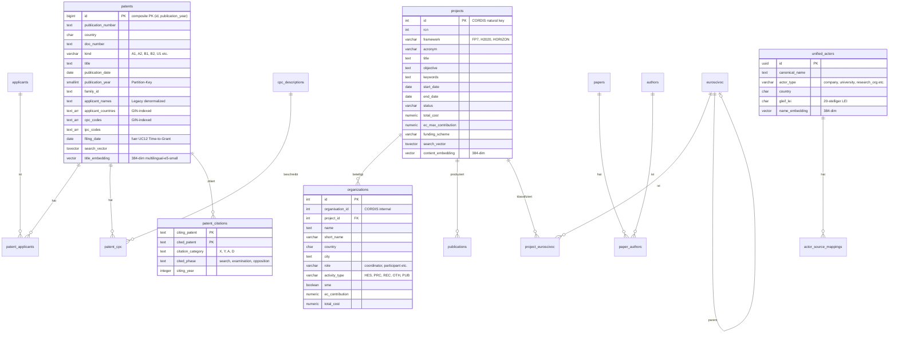

# Datenmodell

## Uebersicht

TI-Radar nutzt eine einzelne PostgreSQL-17-Instanz mit 6 isolierten Schemas. Die Datenbank enthaelt ca. ~540M Zeilen bei einer Gesamtgroesse von ~200 GB. Fuer Vektoraehnlichkeitssuche ist pgvector installiert, fuer unscharfe Textsuche pg_trgm.

**Groessenverteilung nach Schema:**
- `patent_schema`: ~191 GB (inkl. befuellter Junction-Tabellen patent_applicants und patent_cpc)
- `cross_schema`: ~5 GB (Materialized Views und Import-Log)
- `cordis_schema`: ~1.7 GB
- `entity_schema`: ~636 MB

**Speicherempfehlung:** >= 300 GB fuer das PostgreSQL-Datenverzeichnis (inkl. Headroom fuer Indexe, WAL und temporaere Dateien).

---

## Data-Warehouse-Architektur

### Klassifikation

Das Datenmodell ist als **Hybrid-Data-Warehouse (OLTP + OLAP)** klassifiziert. Es kombiniert operative Datenhaltung mit analytischen Strukturen innerhalb einer einzigen PostgreSQL-Instanz.

Die Architektur folgt dem **Faktenkonstellation-Muster (Galaxy Schema)**: Mehrere Fakten-Tabellen teilen sich gemeinsame Dimensions-Tabellen ueber Quellsystem-Grenzen hinweg. Im Gegensatz zu einem klassischen Star- oder Snowflake-Schema existieren hier mehrere unabhaengige Fakten-Sterne, die ueber die Entity-Resolution-Schicht (`entity_schema`) verbunden werden.

### Einordnung nach Inmon vs. Kimball

| Kriterium | Inmon (CIF) | Kimball (Dimensional) | Dieses System |
|---|---|---|---|
| Normalisierung | 3NF | Denormalisiert | **Hybrid** -- normalisierte Basis + denormalisierte Arrays |
| Aufbau | Top-down | Bottom-up (Data Marts) | **Bottom-up** -- Data Marts via Materialized Views |
| Integration | Ueber einheitliches Modell | Conformed Dimensions | **Entity Resolution** (`unified_actors`) |
| Faktentabellen | Enterprise DWH | Dimensionale Modelle | **Faktenkonstellation** (mehrere Sterne) |

Das Modell folgt primaer dem **Kimball-Ansatz** mit Bottom-up Data Marts (Materialized Views), ergaenzt durch eine **Inmon-typische Integrationsschicht** (Entity Resolution ueber `entity_schema`).

### Fakten- und Dimensionstabellen

**Fakten-Tabellen (Transaktionsdaten):**

| Tabelle | Zeilen | Granularitaet | Schema |
|---|---|---|---|
| `patent_cpc` | ~237M | Ein Eintrag pro Patent-CPC-Zuordnung | `patent_schema` |
| `patent_applicants` | ~147M | Ein Eintrag pro Patent-Anmelder-Zuordnung | `patent_schema` |
| `patent_citations` | variabel | Ein Eintrag pro Zitationsbeziehung | `patent_schema` |
| `organizations` | 438K | Ein Eintrag pro Projektbeteiligung | `cordis_schema` |
| `project_euroscivoc` | variabel | Ein Eintrag pro Projekt-Taxonomie-Zuordnung | `cordis_schema` |

**Dimensions-Tabellen (Stammdaten):**

| Tabelle | Zeilen | Dimensionstyp | Schema |
|---|---|---|---|
| `applicants` | ~15.5M | Akteursdimension | `patent_schema` |
| `cpc_descriptions` | ~670 | Technologiedimension (CPC-Klassifikation) | `patent_schema` |
| `projects` | 80.5K | Projektdimension | `cordis_schema` |
| `euroscivoc` | ~220K | Forschungstaxonomie (hierarchisch) | `cordis_schema` |
| `unified_actors` | variabel | Cross-Source-Identitaetsdimension | `entity_schema` |

**Aggregate / Data Marts (Materialized Views):**

Die 9 Materialized Views in `cross_schema` bilden die analytische Schicht -- siehe Abschnitt [Materialized Views](#materialized-views-analytische-schicht).

### Schichtenarchitektur

```
Schicht 1: Quelldaten (Staging)
├── patent_schema   -- EPO DOCDB Bulk-Import (154.8M Patente)
├── cordis_schema   -- CORDIS Bulk-Import (80.5K Projekte)
└── research_schema -- API-Cache (Semantic Scholar, OpenAIRE)

Schicht 2: Integration
└── entity_schema   -- Entity Resolution (EPO + CORDIS + GLEIF)

Schicht 3: Analytik (Data Marts)
└── cross_schema    -- 9 Materialized Views (vorberechnete Aggregate)

Schicht 4: Praesentation
└── export_schema   -- API-Cache, Report-Templates, Export-Audit
```

---

## Datenquellen und Beschaffungsmuster

Das System integriert **5 externe Datenquellen** ueber **2 Beschaffungsmuster**:

### Uebersicht

| # | Quelle | Beschaffung | Schema | Volumen | TTL |
|---|---|---|---|---|---|
| 1 | **EPO DOCDB** | Bulk-Dateiimport (DOCDB-XML) | `patent_schema` | ~154.8M Patente | -- |
| 2 | **CORDIS** | Bulk-Dateiimport (JSON/CSV) | `cordis_schema` | 80.5K Projekte, 438K Orgs, 529K Pubs | -- |
| 3 | **OpenAIRE** | Live-API (on-demand) | `research_schema.openaire_cache` | Publikationszaehlungen | 7 Tage |
| 4 | **Semantic Scholar** | Live-API (on-demand) | `research_schema.papers/authors` | Paper + Zitationsdaten | 30 Tage |
| 5 | **GLEIF** | Live-API (on-demand) | `entity_schema.gleif_cache` | Legal Entity Identifier | 90 Tage |

### Beschaffungsmuster 1: Bulk-Dateiimport (EPO, CORDIS)

EPO- und CORDIS-Daten werden als Bulk-Dateien importiert. Die Dateien muessen manuell im konfigurierten Verzeichnis (`bulk_data_dir`) bereitgestellt werden. Der wochentliche Scheduler verarbeitet dann alle neuen Dateien.

```
Manueller Download         /data/bulk/EPO/        import-svc         patent_schema
(EPO DOCDB-XML-ZIPs)  -->  /data/bulk/CORDIS/  -->  (Scheduler)  -->  cordis_schema
                                                   Sonntag 02:00 UTC
```

**EPO DOCDB:**
- **Format:** Verschachtelte ZIP-Archive mit DOCDB-XML (Namespace `urn:EPO:...`)
- **Dateigrösse:** ~1.4 GB pro Aussen-ZIP, ~195 GB Gesamt
- **Parsing:** Memory-effizientes `iterparse` fuer verschachtelte ZIP-in-ZIP-Strukturen
- **Extraktion:** publication_number, country, title, dates, CPC/IPC-Codes, Anmelder, Zitationen
- **Normalisierung:** Firmen-Suffixe entfernt, Grossschreibung, CPC-Leerzeichen bereinigt

**CORDIS:**
- **Format:** JSON-ZIP-Archive oder CSV-Fallback (FP7, H2020, HORIZON)
- **Datentypen:** Projekte, Organisationen, Publikationen, EuroSciVoc-Taxonomie
- **Parsing:** Batch-Inserts (konfigurierbar, Default 200K Records)
- **Normalisierung:** Europaeisches Dezimalformat (Komma), Boolean-Parsing (YES/true/1)

**Einschraenkung:** Aktuell existiert keine automatisierte Datenbeschaffung ueber die EPO OPS API oder die CORDIS REST API. Fuer aktuelle Daten muessen die Bulk-Dateien manuell aktualisiert werden.

### Beschaffungsmuster 2: Live-API mit DB-Cache (OpenAIRE, GLEIF, Semantic Scholar)

Die drei API-basierten Quellen werden on-demand bei Analyse-Abfragen aufgerufen und transparent gecacht.

```
UC-Service Abfrage --> Adapter (HTTP-Client) --> Externe API
                           |                        |
                           v                        v
                      DB-Cache pruefen         API-Response
                      (TTL abgelaufen?)        verarbeiten
                           |                        |
                           +--- Cache-Hit: sofort zurueck
                           +--- Cache-Miss: API aufrufen, Ergebnis cachen
                           +--- API-Fehler: Stale Cache als Fallback
```

**Gemeinsame Eigenschaften aller API-Adapter:**
- Exponentielles Backoff bei HTTP 429 (Rate Limiting)
- Graceful Degradation: API-Fehler fuehren nicht zum Abbruch der Analyse
- Stale-Cache-Fallback: Abgelaufene Eintraege werden bei API-Ausfaellen zurueckgegeben
- Negative Caching: Fehlende Ergebnisse werden ebenfalls gecacht (verhindert wiederholte Fehlschlaege)

**OpenAIRE** (`landscape-svc`, UC1):
- API: `api.openaire.eu/search/publications`
- Funktion: Zaehlt Publikationen pro Jahr und Technologie
- Adapter: `openaire_adapter.py` mit JWT Token-Management
- Cache: `research_schema.openaire_cache` (7-Tage-TTL)

**Semantic Scholar** (`research-impact-svc`, UC7):
- API: Semantic Scholar Academic Graph API
- Funktion: Paper-Metadaten, Zitationsanalyse, h-Index, Autorendaten
- Cache: `research_schema.papers/authors/query_cache` (30-Tage-TTL)

**GLEIF** (`actor-type-svc`, UC11):
- API: `api.gleif.org/api/v1/fuzzy-completions` (kostenlos, kein API-Key)
- Funktion: Organisationsnamen zu Legal Entity Identifiern aufloesen
- Adapter: `gleif_adapter.py` mit Fuzzy-Name-Matching und Rate-Limiting (55 RPM)
- Cache: `entity_schema.gleif_cache` (90-Tage-TTL, auch Negativ-Ergebnisse)

---

## ETL/ELT-Pipeline

Das System folgt einem **ELT-Muster** (Extract-Load-Transform): Rohdaten werden zuerst in die operativen Schemas geladen und dann ueber Materialized Views in analytische Aggregate transformiert.

### Pipeline-Ablauf

```
1. Extract      2. Load              3. Transform           4. Serve
   (Quellen)       (Operative Schemas)  (Analytische Schicht)  (UC-Services)

EPO XML -------> patent_schema -----> cross_schema          --> UC1-UC12
CORDIS JSON ---> cordis_schema -----> (9 Materialized       --> UC-C
                                       Views)
OpenAIRE API --> research_schema                            --> UC1
Sem. Scholar --> research_schema                            --> UC7
GLEIF API -----> entity_schema                              --> UC11
```

### Import-Reihenfolge und Abhaengigkeiten

```
1. EuroSciVoc  (schnellstes, Taxonomie-Referenzdaten)
       |
       v
2. CORDIS      (Projekte, Organisationen, Publikationen)
       |
       v
3. EPO         (154.8M Patente, kann Stunden dauern)
       |
       v
4. Materialized Views Refresh (automatisch nach Import)
   ├── Patent-Views  (5 MVs nach EPO-Import)
   └── CORDIS-Views  (4 MVs nach CORDIS-Import)
```

### Idempotenz und Deduplizierung

- **Import-Log:** `cross_schema.import_log` mit UNIQUE auf `(source, filename)` verhindert Doppelimporte
- **EPO:** Eindeutigkeit ueber `(publication_number, publication_year)` -- existierende Eintraege werden uebersprungen
- **CORDIS:** Upsert-Logik -- existierende Projekte/Organisationen werden aktualisiert
- **Inkrementeller Import:** Beim Neustart setzt der Import dort fort, wo er aufgehoert hat

### Scheduler-Konfiguration

| Parameter | Default | Beschreibung |
|---|---|---|
| `IMPORT_SCHEDULE` | `0 2 * * 0` | Cron-Ausdruck (Sonntag 02:00 UTC) |
| `SCHEDULER_ENABLED` | `true` | Scheduler aktivieren/deaktivieren |
| `SCHEDULER_TIMEZONE` | `UTC` | Zeitzone fuer den Cron-Trigger |

### ETL-Monitoring

| Tabelle | Schema | Funktion |
|---|---|---|
| `import_log` | `cross_schema` | Import-Tracking: Quelle, Dateiname, Status, Record-Count, Dauer |
| `etl_checkpoints` | `cross_schema` | Per-Source Sync-State: Cursor, last_sync_at, records_synced |
| `etl_run_log` | `cross_schema` | ETL-Ausfuehrungshistorie: Start, Ende, Status, Records-Statistik |
| `import_metadata` | `patent_schema` | EPO-ZIP-Datei-Tracking fuer Resume-Unterstuetzung |
| `import_metadata` | `cordis_schema` | CORDIS-Quell-Tracking (FP7, H2020, HORIZON) |

---

## Datenbankschemas

### patent_schema

EPO-Patentdaten und patentspezifische Analysen. Genutzt von: UC1 (Landscape), UC2 (Maturity), UC3 (Competitive), UC5 (CPC-Flow), UC6 (Geographic), UC8 (Temporal), UC9 (Tech-Cluster), UC12 (Patent-Grant).

| Tabelle | Zeilen | Beschreibung |
|---|---|---|
| `patents` | ~154.8M | Haupttabelle, range-partitioned nach `publication_year` |
| `applicants` | ~15.5M | Normalisierte Patentanmelder |
| `patent_applicants` | ~147M | N:M-Zuordnung Patent-Anmelder, co-partitioned nach `patent_year` |
| `patent_cpc` | ~237M | N:M-Zuordnung Patent-CPC-Klasse, co-partitioned nach `pub_year` |
| `patent_citations` | variabel | Forward-/Backward-Zitationen zwischen Patenten |
| `cpc_descriptions` | ~670 | CPC-Subclass-Beschreibungen (Referenzdaten) |
| `import_metadata` | variabel | Tracking verarbeiteter EPO-DOCDB-ZIP-Dateien |
| `enrichment_progress` | variabel | Patent-Embedding-Enrichment-Tracking |

#### patents -- Spaltenstruktur

| Spalte | Typ | Beschreibung |
|---|---|---|
| `id` | `BIGINT` | Identity Primary Key |
| `publication_number` | `TEXT` | Natuerlicher Schluessel (z.B. EP1234567A1) |
| `country` | `CHAR(2)` | Ausstellungsland (CHECK: `^[A-Z]{2}$`) |
| `doc_number` | `TEXT` | Dokumentennummer |
| `kind` | `VARCHAR` | Dokumentart (A1, A2, B1, B2, U1 etc., CHECK: `^[A-Z][0-9]?$`) |
| `title` | `TEXT` | Patenttitel |
| `publication_date` | `DATE` | Veroeffentlichungsdatum |
| `publication_year` | `SMALLINT` | Extrahiert via Trigger, Partition-Key (CHECK: 1900-2100) |
| `filing_date` | `DATE` | Anmeldedatum (fuer UC12 Time-to-Grant) |
| `family_id` | `TEXT` | Patentfamilien-ID |
| `applicant_names` | `TEXT` | Legacy denormalisiertes Feld |
| `applicant_countries` | `TEXT[]` | Array von ISO-Laendercodes (GIN-indiziert) |
| `cpc_codes` | `TEXT[]` | Array von CPC-Klassifikationscodes (GIN-indiziert) |
| `ipc_codes` | `TEXT[]` | Array von IPC-Klassifikationscodes |
| `search_vector` | `tsvector` | Volltextsuche (Trigger-gepflegt aus title + CPC) |
| `title_embedding` | `vector(384)` | Semantische Einbettung (multilingual-e5-small, provisioniert) |

**Primary Key:** `(id, publication_year)` -- partitions-aware Composite Key.

#### Partitionierungsstrategie

Die `patents`-Tabelle ist nach `publication_year` range-partitioniert:

| Partition | Bereich | Zeitspanne |
|---|---|---|
| `patents_pre1980` | 1900-1979 | 80 Jahre |
| `patents_1980s` | 1980-1989 | 10 Jahre |
| `patents_1990s` | 1990-1999 | 10 Jahre |
| `patents_2000` bis `patents_2030` | je 1 Jahr | Per-Year |
| `patents_future` | 2031+ | Zukunft |

**Vorteil:** Partition Pruning eliminiert ganze Dekaden bei zeitlich eingeschraenkten Abfragen. Eine Abfrage mit `WHERE publication_year BETWEEN 2020 AND 2025` scannt nur 6 von ~35 Partitionen.

Die Junction-Tabellen `patent_applicants` und `patent_cpc` sind **co-partitioniert** nach demselben Schema, sodass Joins innerhalb einer Partition bleiben.

**Design-Entscheidungen:**
- BRIN-Indexe auf Datumsspalten (100-1000x kleiner als B-Tree bei chronologisch importierten Daten)
- tsvector-Spalten mit GIN-Index ersetzen SQLite FTS5
- TEXT[]-Arrays mit GIN-Index fuer Laender- und CPC-Abfragen (Containment-Operatoren `@>`, `&&`)
- Covering-Indexe auf `patent_cpc` (cpc_code, pub_year, patent_id) fuer Index-Only-Scans bei CPC-Kookkurrenz
- Integer-PKs in Junctions: 4-Byte-Integer sparen ~3 GB gegenueber 16-Byte-UUIDs bei 237M Zeilen

#### Trigger

| Trigger | Funktion |
|---|---|
| `trg_patents_search_vector` | Pflegt `search_vector` aus `title` + `cpc_codes` |
| `trg_patents_year` | Extrahiert `publication_year` aus `publication_date` |

### cordis_schema

CORDIS-EU-Forschungsprojektdaten. Genutzt von: UC4 (Funding), UC6 (Geographic), UC10 (EuroSciVoc), UC11 (Actor-Type), UC-C (Publication).

| Tabelle | Zeilen | Beschreibung |
|---|---|---|
| `projects` | 80.5K | EU-Forschungsprojekte (FP7, H2020, HORIZON) |
| `organizations` | 438K | Projektbeteiligte mit Typ (HES, PRC, REC, PUB, OTH) |
| `publications` | 529K | Projektpublikationen mit DOI-Deduplizierung |
| `euroscivoc` | ~220K | EuroSciVoc-Taxonomie (hierarchisch, self-referencing) |
| `project_euroscivoc` | variabel | N:M-Zuordnung Projekte zu EuroSciVoc-Kategorien |
| `import_metadata` | variabel | Tracking verarbeiteter CORDIS-Dateien |

**Constraints:**
- `projects.framework` IN (`'FP7'`, `'H2020'`, `'HORIZON'`, `'UNKNOWN'`)
- `organizations.role` IN (`'coordinator'`, `'participant'`, `'partner'`, `'associatedpartner'`, `'thirdparty'`, `'internationalpartner'`)
- `organizations.activity_type` IN (`'HES'`, `'PRC'`, `'REC'`, `'OTH'`, `'PUB'`)
- `organizations.sme` -- nativer BOOLEAN (nicht TEXT)
- `euroscivoc.parent_code` -- Self-Referencing FK fuer hierarchische Taxonomie (Level 0-10)
- `publications.doi` -- UNIQUE Constraint

**Trigger:**
- `trg_projects_search_vector` -- Pflegt `tsvector` aus `title` + `objective` + `keywords`
- `trg_publications_search_vector` -- Pflegt `tsvector` aus `title` + `authors` + `journal`

### research_schema

Semantic-Scholar- und OpenAIRE-Cache fuer Forschungswirkungsanalyse. Genutzt von: UC1 (Landscape, OpenAIRE), UC7 (Research-Impact, Semantic Scholar).

| Tabelle | Beschreibung | TTL |
|---|---|---|
| `papers` | Gecachte Paper-Metadaten (Zitationen, Venue, Open Access) | 30 Tage |
| `authors` | Gecachte Autorendaten (h-Index, Affiliations) | 30 Tage |
| `paper_authors` | N:M-Zuordnung Paper-Autoren (mit `author_position`) | 30 Tage |
| `query_cache` | Tracking gecachter Semantic-Scholar-Abfragen | 30 Tage |
| `openaire_cache` | Gecachte OpenAIRE-Publikationszaehler pro (Keyword, Jahr) | 7 Tage |
| `openaire_publications` | Persistierte OpenAIRE-Publikationsdaten | -- |

**Cache-Strategie:**
- Jeder Eintrag hat eine `stale_after`-Spalte (Timestamp)
- Frische Eintraege (`stale_after > now()`) werden direkt zurueckgegeben
- Abgelaufene Eintraege werden bei API-Ausfaellen als Fallback genutzt (Graceful Degradation)
- Bereinigungsfunktion: `research_schema.purge_stale_papers()` entfernt Eintraege aelter als 30 Tage

### entity_schema

Entity Resolution fuer quellenuebergreifendes Akteurs-Matching (EPO + CORDIS + GLEIF).

| Tabelle | Beschreibung |
|---|---|
| `unified_actors` | Vereinheitlichte Akteure mit UUID, kanonischem Namen, Typ, Land |
| `actor_source_mappings` | Zuordnung zu Quellsystem-IDs mit Konfidenz und Match-Methode |
| `gleif_cache` | GLEIF Legal Entity Identifier Cache (90-Tage-TTL) |
| `resolution_runs` | Audit-Log der Entity-Resolution-Laeufe |

#### Entity-Resolution-Prozess

Der Entity-Resolution-Prozess vereinheitlicht Akteure aus drei Quellsystemen (EPO-Anmelder, CORDIS-Organisationen, GLEIF-Register) zu einem einzigen `unified_actors`-Eintrag:

```
EPO applicants.normalized_name ──┐
                                  ├──> Matching ──> unified_actors (UUID)
CORDIS organizations.name ───────┤      |               |
                                  │      v               v
GLEIF gleif_cache.legal_name ────┘   Konfidenz    actor_source_mappings
                                    (0.0 - 1.0)   (source_type, source_id)
```

**Matching-Methoden:**

| Methode | Beschreibung | Konfidenz |
|---|---|---|
| `exact` | Exakter Namensabgleich (nach Normalisierung) | 1.0 |
| `fuzzy_trgm` | pg_trgm Trigramm-Aehnlichkeit (`ti_fuzzy_score()`) | 0.7-0.99 |
| `levenshtein` | Levenshtein-Distanz fuer kurze Namen | 0.6-0.9 |
| `lei_match` | GLEIF LEI als eindeutiger Identifikator | 1.0 |
| `manual` | Manuell zugeordnet | 1.0 |

**Akteurs-Typen:** `company`, `university`, `research_org`, `individual`, `government`

**Quell-Typen:** `epo_applicant`, `cordis_org`, `gleif`

#### gleif_cache -- Spaltenstruktur

| Spalte | Typ | Beschreibung |
|---|---|---|
| `raw_name` | `TEXT` (PK) | Originaler Abfragename |
| `lei` | `CHAR(20)` | 20-stelliger LEI oder NULL (Negativ-Ergebnis) |
| `legal_name` | `TEXT` | Offizieller Name laut GLEIF |
| `country` | `CHAR(2)` | ISO 3166-1 Alpha-2 Laendercode |
| `entity_status` | `VARCHAR(20)` | GLEIF Entity Status |
| `resolved_at` | `TIMESTAMPTZ` | Zeitstempel der Cache-Aufloesung |

- **TTL:** 90 Tage. Negativ-Ergebnisse (kein LEI gefunden) werden mit `lei = NULL` gecacht.
- **Bereinigung:** `entity_schema.purge_stale_gleif()` entfernt abgelaufene Eintraege.

### cross_schema

Quellenuebergreifende Materialized Views fuer OLAP-Analysen und Import-Tracking. Genutzt von: UC1 (Landscape), UC3 (Competitive), UC4 (Funding), UC5 (CPC-Flow), UC6 (Geographic), UC8 (Temporal).

#### Tabellen

| Tabelle | Beschreibung |
|---|---|
| `import_log` | Inkrementelles Import-Tracking (Quelle, Dateiname, Status, Dauer) |
| `etl_checkpoints` | Per-Source Sync-State (Cursor, last_sync_at, records_synced) |
| `etl_run_log` | ETL-Ausfuehrungshistorie (started_at, finished_at, Status, Records) |
| `document_chunks` | RAG-Dokumenten-Chunks mit Embeddings (vector(384)) |

#### Materialized Views (Analytische Schicht)

Die 9 Materialized Views bilden die **analytische Schicht (Data Marts)** des Data Warehouse. Sie loesen teure Joins und Aggregationen ueber hunderte Millionen Zeilen durch Vorberechnung auf.

| Materialized View | Basistabellen | Genutzt von | Zweck |
|---|---|---|---|
| `mv_patent_counts_by_cpc_year` | `patent_cpc` | UC1, UC5, UC8 | Patentanzahl pro CPC-Klasse und Jahr -- ersetzt COUNT-Aggregation ueber 237M Zeilen |
| `mv_cpc_cooccurrence` | `patent_cpc` (Self-Join) | UC5 | CPC-Paar-Kookkurrenz mit Jaccard-Koeffizient -- ersetzt 237M-Zeilen-Self-Join |
| `mv_yearly_tech_counts` | `patent_cpc` | UC1 | Jaehrliche Technologie-Zaehler fuer Zeitreihenanalyse |
| `mv_top_applicants` | `applicants`, `patent_applicants`, `patents` | UC3, UC8 | Top-Anmelder mit >= 10 Patenten und Jahresverteilung |
| `mv_patent_country_distribution` | `patents` (unnest) | UC6 | Patente nach Anmelder-Land pro Jahr -- ersetzt UNNEST ueber 154.8M Zeilen |
| `mv_project_counts_by_year` | `projects` | UC1, UC4 | CORDIS-Projekte + Foerdervolumen pro Jahr und Framework |
| `mv_cordis_country_pairs` | `projects`, `organizations` | UC6 | Laender-Kooperationspaare in CORDIS-Projekten |
| `mv_top_cordis_orgs` | `organizations`, `projects` | UC3, UC4, UC8 | Top-Organisationen mit >= 3 Projekten (SME/Coordinator-Flags) |
| `mv_funding_by_instrument` | `projects` | UC4 | Foerdervolumen pro Instrument (RIA, IA, CSA, ERC) und Jahr |

**Refresh-Strategie:**

- Alle MVs verwenden `REFRESH MATERIALIZED VIEW CONCURRENTLY` (erfordert UNIQUE INDEX auf jeder MV)
- Concurrent Refresh setzt **keine Lese-Sperren** -- Analyse-Abfragen laufen waehrend des Refreshs weiter
- Refresh wird automatisch nach jedem erfolgreichen Import ausgeloest:
  - EPO-Import: 5 Patent-Views (`refresh_patent_views()`)
  - CORDIS-Import: 4 CORDIS-Views (`refresh_cordis_views()`)
  - Manuell: `refresh_all_views()` fuer alle 9 MVs
- Endpoint: `POST /api/v1/import/refresh-views`

### export_schema

Export-Service-Cache und Report-Templates. Genutzt von: Export-Service.

| Tabelle | Beschreibung |
|---|---|
| `analysis_cache` | Gecachte Analyseergebnisse (JSONB, 24h TTL, SHA-256-Deduplizierung) |
| `report_templates` | Vorlagen fuer CSV/PDF/XLSX/JSON-Reports |
| `export_log` | Audit-Log der Exporte (Technologie, Format, Zeilenanzahl, Dateigroesse, Dauer) |

**Cache-Strategie:**
- Cache-Key: SHA-256 ueber `(technology, start_year, end_year, use_cases, european_only)`
- TTL: 24 Stunden (konfigurierbar)
- Bereinigung: `export_schema.purge_expired_cache()` entfernt abgelaufene Eintraege

---

## ER-Diagramm (vereinfacht)



---

## Indexierungsstrategie

| Index-Typ | Einsatz | Vorteil |
|---|---|---|
| **BRIN** | Datumsspalten (`publication_date`, `start_date`) | 100-1000x kleiner als B-Tree bei chronologisch importierten Daten (~200 KB fuer 154M Zeilen) |
| **GIN (tsvector)** | Volltextsuche auf Titeln und Beschreibungen | Ersetzt SQLite FTS5, unterstuetzt gewichtete Suche |
| **GIN (pg_trgm)** | Fuzzy-Suche und Autocomplete auf Namen | Trigramm-basiert, toleriert Tippfehler |
| **GIN (Array)** | TEXT[]-Spalten (`applicant_countries`, `cpc_codes`) | Containment-Operatoren (`@>`, `&&`) statt O(n) LIKE-Scans |
| **B-Tree** | Fremdschluessel, `family_id`, `country`, `filing_date` | Standard-Lookups und Bereichsabfragen |
| **Covering** | `patent_cpc` (cpc_code, pub_year, patent_id) | Index-Only-Scans fuer CPC-Kookkurrenz-Queries (kein Heap-Zugriff) |

### Volltextsuche-Funktionen

| Funktion | Beschreibung |
|---|---|
| `ti_plainto_tsquery(TEXT)` | Normalisierte englische Stemming-Suche (mit `unaccent`) |
| `ti_websearch_tsquery(TEXT)` | Websearch-Syntax mit "Phrasen" und OR-Verknuepfungen |
| `ti_fuzzy_score(TEXT, TEXT)` | pg_trgm Trigramm-Aehnlichkeit (0.0-1.0) |

---

## Vektor-Embeddings

**Modell:** multilingual-e5-small (384 Dimensionen)

| Spalte | Schema | Einsatz |
|---|---|---|
| `patents.title_embedding` | `patent_schema` | Semantische Patent-Titelsuche |
| `projects.content_embedding` | `cordis_schema` | Semantische Projektbeschreibungssuche |
| `papers.abstract_embedding` | `research_schema` | Semantische Abstrakt-Suche |
| `unified_actors.name_embedding` | `entity_schema` | Semantischer Akteursvergleich |
| `document_chunks.embedding` | `cross_schema` | RAG-Chunks fuer semantische Suche |

**Status:** Spalten provisioniert (Typ `vector(384)`), aber noch nicht befuellt. Vorgesehen fuer kuenftige LLM-Enrichment-Pipeline.

---

## Datenbankrollen und Berechtigungen

Das System implementiert ein **RBAC-Modell (Role-Based Access Control)** mit Schema-Isolation:

### Service-Rollen (Read-Only)

Jeder UC-Service hat eine eigene Datenbank-Rolle mit SELECT-Berechtigung auf seine benoetigen Schemas:

| Rolle | Service | Liest aus |
|---|---|---|
| `svc_landscape` | UC1 | `patent_schema`, `cordis_schema`, `cross_schema`, `research_schema` |
| `svc_maturity` | UC2 | `patent_schema`, `cross_schema` |
| `svc_competitive` | UC3 | `patent_schema`, `cordis_schema`, `cross_schema`, `entity_schema` |
| `svc_funding` | UC4 | `cordis_schema`, `cross_schema` |
| `svc_cpc_flow` | UC5 | `patent_schema`, `cross_schema` |
| `svc_geographic` | UC6 | `patent_schema`, `cordis_schema`, `cross_schema` |
| `svc_research_impact` | UC7 | `research_schema`, `cross_schema` |
| `svc_temporal` | UC8 | `patent_schema`, `cordis_schema`, `cross_schema` |
| `svc_tech_cluster` | UC9 | `patent_schema`, `cross_schema` |
| `svc_euroscivoc` | UC10 | `cordis_schema` |
| `svc_actor_type` | UC11 | `cordis_schema`, `entity_schema` (+ Schreibrecht auf `gleif_cache`) |
| `svc_patent_grant` | UC12 | `patent_schema` |
| `svc_publication` | UC-C | `patent_schema`, `cordis_schema`, `research_schema` |

### Admin-Rollen

| Rolle | Berechtigungen |
|---|---|
| `tip_admin` | Vollzugriff auf alle Schemas (Superuser fuer TI-Radar) |
| `tip_readonly` | SELECT auf alle Schemas (fuer pgAdmin, Monitoring) |
| `importer_epo` | INSERT/UPDATE auf `patent_schema` |
| `importer_cordis` | INSERT/UPDATE auf `cordis_schema` |

### Zugriffsmuster pro Service

```
                    patent_  cordis_  research_  entity_  cross_   export_
                    schema   schema   schema     schema   schema   schema
  UC1 Landscape      R        R        R                   R
  UC2 Maturity       R                                     R
  UC3 Competitive    R        R                  R         R
  UC4 Funding                 R                            R
  UC5 CPC-Flow       R                                     R
  UC6 Geographic     R        R                            R
  UC7 Research                         R                   R
  UC8 Temporal       R        R                            R
  UC9 Tech-Cluster   R                                     R
  UC10 EuroSciVoc             R
  UC11 Actor-Type             R                  R/W
  UC12 Patent-Grant  R
  UC-C Publication   R        R        R
  Import-Service     W        W        W         W         W        W
  Export-Service     R        R        R         R         R        R/W

  R = Read (SELECT), W = Write (INSERT/UPDATE), R/W = beides
```

---

## Datenqualitaet und Validierung

### CHECK-Constraints

| Tabelle | Constraint | Regel |
|---|---|---|
| `patents` | `country` | `^[A-Z]{2}$` (ISO 3166-1 Alpha-2) |
| `patents` | `kind` | `^[A-Z][0-9]?$` |
| `patents` | `publication_year` | BETWEEN 1900 AND 2100 |
| `organizations` | `role` | Enum-Whitelist (6 Werte) |
| `organizations` | `activity_type` | Enum-Whitelist (5 Werte) |
| `projects` | `framework` | Enum-Whitelist (4 Werte) |
| `actor_source_mappings` | `source_type` | Enum-Whitelist (3 Werte) |
| `actor_source_mappings` | `confidence` | 0.0-1.0 |
| `actor_source_mappings` | `match_method` | Enum-Whitelist (5 Werte) |

### Datentransformationen beim Import

| Quelle | Transformation | Beschreibung |
|---|---|---|
| EPO | Datumsformate | ISO, YYYYMMDD, DD/MM/YYYY -> DATE |
| EPO | Anmelder-Normalisierung | Firmen-Suffixe entfernt, Grossschreibung |
| EPO | CPC-Normalisierung | Leerzeichen entfernt (z.B. "H04N   7/152" -> "H04N7/152") |
| EPO | Array-Konvertierung | CSV-Text -> PostgreSQL TEXT[] |
| CORDIS | Boolean-Parsing | YES/true/1 -> BOOLEAN |
| CORDIS | Dezimalformat | Europaeisches Komma -> Punkt |
| CORDIS | Framework-Erkennung | Automatisch aus Dateiname (FP7, H2020, HORIZON) |
