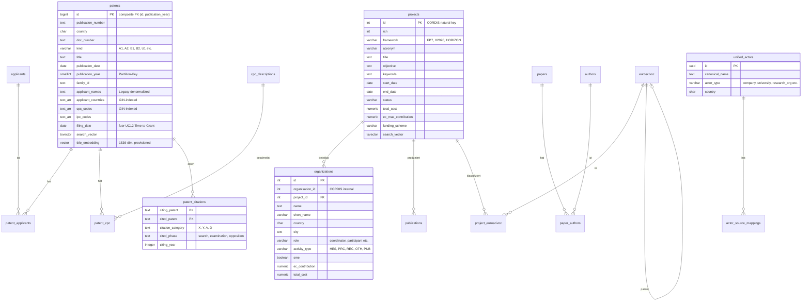

# Datenmodell

## Übersicht

TI-Radar nutzt eine einzelne PostgreSQL-17-Instanz mit 6 isolierten Schemas. Die Datenbank enthält ca. ~540M Zeilen bei einer Gesamtgröße von ~200 GB. Für Vektorähnlichkeitssuche ist pgvector installiert, für unscharfe Textsuche pg_trgm.

**Größenverteilung nach Schema:**
- `patent_schema`: ~191 GB (inkl. befüllter Junction-Tabellen patent_applicants und patent_cpc)
- `cross_schema`: ~5 GB (Materialized Views und Import-Log)
- `cordis_schema`: ~1.7 GB
- `entity_schema`: ~636 MB

**Speicherempfehlung:** >= 300 GB für das PostgreSQL-Datenverzeichnis (inkl. Headroom für Indexe, WAL und temporäre Dateien).

## Datenquellen

| Quelle | Beschreibung | Volumen | Schema |
|---|---|---|---|
| EPO DOCDB | Europäisches Patentamt, weltweite Patentpublikationen | ~154.8M Patente | `patent_schema` |
| CORDIS | EU-Forschungsprojekte (FP7, H2020, Horizon Europe) | 80.5K Projekte, 438K Organisationen, 529K Publikationen | `cordis_schema` |
| OpenAIRE | Open-Access-Publikationen | via API | `research_schema` |
| Semantic Scholar | Zitations- und Autorendaten | Cache-basiert | `research_schema` |
| GLEIF | Legal Entity Identifier für Akteurs-Matching | Cache | `entity_schema` |

## Datenbankschemas

### patent_schema

EPO-Patentdaten und patentspezifische Analysen. Genutzt von: UC1 (Landscape), UC2 (Maturity), UC3 (Competitive), UC5 (CPC-Flow), UC6 (Geographic), UC8 (Temporal), UC9 (Tech-Cluster), UC12 (Patent-Grant).

| Tabelle | Zeilen | Beschreibung |
|---|---|---|
| `patents` | ~154.8M | Haupttabelle, range-partitioned nach `publication_year` |
| `applicants` | ~15.5M | Normalisierte Patentanmelder |
| `patent_applicants` | ~147M | N:M-Zuordnung Patent-Anmelder, co-partitioned nach `patent_year` |
| `patent_cpc` | ~237M | N:M-Zuordnung Patent-CPC-Klasse, co-partitioned nach `pub_year` |
| `patent_citations` | variabel | Forward-/Backward-Zitationen zwischen Patenten |
| `cpc_descriptions` | ~670 | CPC-Subclass-Beschreibungen (Referenzdaten) |
| `import_metadata` | variabel | Tracking verarbeiteter EPO-DOCDB-ZIP-Dateien |

**Design-Entscheidungen:**
- Range-Partitionierung nach `publication_year`: Partition Pruning eliminiert ganze Dekaden
- Co-Partitionierung der Junction-Tabellen `patent_applicants` und `patent_cpc` für partitions-lokale Joins
- BRIN-Indexe auf Datumsspalten (100-1000x kleiner als B-Tree)
- tsvector-Spalten mit GIN-Index ersetzen SQLite FTS5
- TEXT[]-Arrays mit GIN-Index für Länder- und CPC-Abfragen
- Covering-Indexe auf `patent_cpc` (cpc_code, pub_year, patent_id) für Index-Only-Scans bei CPC-Kookkurrenz

### cordis_schema

CORDIS-EU-Forschungsprojektdaten. Genutzt von: UC4 (Funding), UC10 (EuroSciVoc), UC11 (Actor-Type), UC-C (Publication).

| Tabelle | Zeilen | Beschreibung |
|---|---|---|
| `projects` | 80.5K | EU-Forschungsprojekte (FP7, H2020, HORIZON) |
| `organizations` | 438K | Projektbeteiligte mit Typ (HES, PRC, REC, PUB, OTH) |
| `publications` | 529K | Projektpublikationen mit DOI-Deduplizierung |
| `euroscivoc` | ~220K | EuroSciVoc-Taxonomie (hierarchisch, self-referencing) |
| `project_euroscivoc` | variabel | Zuordnung Projekte zu EuroSciVoc-Kategorien |
| `import_metadata` | variabel | Tracking verarbeiteter CORDIS-Dateien |

### research_schema

Semantic-Scholar- und OpenAIRE-Cache für Forschungswirkungsanalyse. Genutzt von: UC1 (Landscape, OpenAIRE), UC7 (Research-Impact, Semantic Scholar).

| Tabelle | Beschreibung |
|---|---|
| `papers` | Gecachte Paper-Metadaten (Zitationen, Venue, Open Access) |
| `authors` | Gecachte Autorendaten (h-Index, Affiliations) |
| `paper_authors` | N:M-Zuordnung Paper-Autoren |
| `query_cache` | Tracking gecachter Semantic-Scholar-Abfragen (Technologie, Zeitraum) |
| `openaire_cache` | Gecachte OpenAIRE-Publikationszähler pro (Keyword, Jahr) |

- Semantic Scholar: 30-Tage-TTL auf `papers`, `authors`, `query_cache`
- OpenAIRE: 7-Tage-TTL auf `openaire_cache`
- Graceful Degradation: Abgelaufene Cache-Einträge werden als Fallback genutzt, wenn externe APIs nicht erreichbar sind

### entity_schema

Entity Resolution für quellenübergreifendes Akteurs-Matching (EPO + CORDIS + GLEIF).

| Tabelle | Zeilen | Beschreibung |
|---|---|---|
| `unified_actors` | 983K | Vereinheitlichte Akteure mit UUID |
| `actor_source_mappings` | variabel | Zuordnung zu Quellsystem-IDs |
| `gleif_cache` | variabel | GLEIF Legal Entity Identifier Cache |
| `resolution_runs` | variabel | Audit-Log der Entity-Resolution-Läufe |

- pg_trgm Fuzzy-Matching für Namensabgleich

### cross_schema

Quellenübergreifende Materialized Views für OLAP-Analysen und Import-Tracking. Genutzt von: UC1 (Landscape), UC3 (Competitive), UC4 (Funding), UC5 (CPC-Flow), UC6 (Geographic), UC8 (Temporal).

#### Tabellen

| Tabelle | Beschreibung |
|---|---|
| `import_log` | Inkrementelles Import-Tracking (Quelle, Dateiname, Status, Dauer) |

#### Materialized Views

| Materialized View | Beschreibung |
|---|---|
| `mv_patent_counts_by_cpc_year` | Patentanzahl pro CPC-Klasse und Jahr |
| `mv_cpc_cooccurrence` | CPC-Paar-Kookkurrenz (Top-200 CPC-Codes, Jaccard-Koeffizienten) |
| `mv_yearly_tech_counts` | Jährliche Technologie-Zähler (Patent + Projekt) |
| `mv_top_applicants` | Top-Patentanmelder mit Jahresverteilung (nur Anmelder mit >= 10 Patenten) |
| `mv_patent_country_distribution` | Länderverteilung der Patente |
| `mv_project_counts_by_year` | CORDIS-Projekte pro Jahr mit Framework-Aufschlüsselung |
| `mv_cordis_country_pairs` | Länderpaare in CORDIS-Kooperationen |
| `mv_top_cordis_orgs` | Top-Organisationen in CORDIS (nur Orgs mit >= 3 Projekten) |
| `mv_funding_by_instrument` | Fördervolumen pro Instrument und Jahr |

Refresh: `REFRESH MATERIALIZED VIEW CONCURRENTLY` via Datenbank-Funktionen (`refresh_all_views()`, `refresh_patent_views()`, `refresh_cordis_views()`) nach jedem Bulk-Import.

### export_schema

Export-Service-Cache und Report-Templates. Genutzt von: Export-Service.

| Tabelle | Beschreibung |
|---|---|
| `analysis_cache` | Gecachte Analyseergebnisse (JSONB, 24h TTL, SHA-256-Deduplizierung) |
| `report_templates` | Vorlagen für CSV/PDF/XLSX/JSON-Reports |
| `export_log` | Audit-Log der Exporte |

## ER-Diagramm (vereinfacht)

## Indexierungsstrategie

| Index-Typ | Einsatz | Vorteil |
|---|---|---|
| BRIN | Datumsspalten (publication_date, start_date) | 100-1000x kleiner als B-Tree bei chronologisch importierten Daten |
| GIN (tsvector) | Volltextsuche auf Titeln und Beschreibungen | Ersetzt SQLite FTS5, unterstützt gewichtete Suche |
| GIN (pg_trgm) | Fuzzy-Suche und Autocomplete | Trigramm-basiert, toleriert Tippfehler |
| GIN (Array) | TEXT[]-Spalten (applicant_countries, cpc_codes) | Containment-Operatoren (@>, &&) statt LIKE-Scans |
| B-Tree | Fremdschlüssel, Family-IDs | Standard-Lookups |
| Covering | patent_cpc (cpc_code, pub_year, patent_id) | Index-Only-Scans für CPC-Kookkurrenz-Queries |
