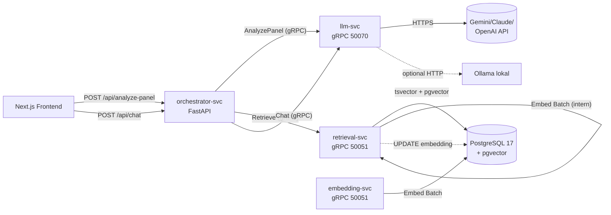

# LLM-Integration

Die LLM-Integration von TI-Radar liefert textuelle KI-Analysen zu jedem UC-Panel (v3.5.0) und einen RAG-gestützten Chat (v3.6.0). Dieser Text dokumentiert die Architektur, die beteiligten Services, Datenflüsse, Konfiguration und Betriebsaspekte.

## Inhaltsübersicht

1. [Motivation](#1-motivation)
2. [Architektur](#2-architektur)
3. [Datenflüsse](#3-datenflüsse)
4. [Konfiguration](#4-konfiguration)
5. [Incremental Pre-Computation](#5-incremental-pre-computation-embeddings)
6. [Frontend-Integration](#6-frontend-integration)
7. [Graceful Degradation](#7-graceful-degradation)
8. [Faithfulness-Guards (Opt-in)](#8-faithfulness-guards-opt-in)
9. [Betrieb und Monitoring](#9-betrieb-und-monitoring)
10. [Bekannte Grenzen](#10-bekannte-grenzen)

---

## 1. Motivation

Das Tool zeigt pro UC-Panel zahlreiche Kennzahlen und Visualisierungen. Für einen Entscheider sind rohe Zahlen alleine wenig hilfreich — die **Interpretation** ist der Wertbeitrag. Die LLM-Integration übernimmt diese Interpretation automatisch:

- **Panel-Analysen** (v3.5.0): Pro Detail-View werden die Panel-Daten an ein LLM gesendet, das eine 2-3-Absatz-Markdown-Analyse in deutscher Sprache generiert.
- **RAG-Chat** (v3.6.0): Nutzer können Fragen zu der Technologie stellen; das LLM antwortet mit semantisch retrievter Evidenz aus den EPO-Patent-, CORDIS-Projekt- und Paper-Datenbanken.

Beides läuft vollständig abschaltbar — ohne LLM-Key funktioniert das Tool wie vorher.

---

## 2. Architektur

### 2.1 Services im Überblick

| Service | Rolle | Port | RAM | State |
|---|---|---|---|---|
| `llm-svc` | Multi-Provider-LLM-Gateway (Gemini/Claude/OpenAI/Ollama); 13 UC-Prompts + Chat-Prompt | 50070 | 512 MB | stateless |
| `embedding-svc` | sentence-transformers `multilingual-e5-small` (384-dim); embedded Texte für Retrieval | 50051 (überschrieben)¹ | 2 GB | Modell im RAM |
| `retrieval-svc` | Hybrid-Search: tsvector-Candidate + pgvector-Re-Ranking + Cross-Encoder; **Incremental-Embedding** schreibt fehlende Embeddings on-the-fly in die DB | 50051 (überschrieben)¹ | 2 GB | Modelle im RAM |
| `orchestrator-svc` | Erweitert um REST-Endpoints `/api/v1/analyze-panel` und `/api/v1/chat`; forwardet per gRPC | 8000 | 512 MB | stateless |

¹ Dockerfile-Default ist 50080 (embedding) bzw. 50081 (retrieval). `docker-compose.server.yml` setzt `EMBEDDING_SERVICE_PORT=50051` und `RETRIEVAL_SERVICE_PORT=50051` als ENV-Override, damit der Orchestrator-Adress-Default (`*:50051`) greift. Ohne diesen Override können die Services nicht erreicht werden.

### 2.2 Service-Graph



### 2.3 Warum drei LLM-Services statt einem?

**Separation of Concerns:**
- `llm-svc` hat keinen DB-Zugriff — rein externer API-Wrapper. Dadurch ist der Blast-Radius bei Model-Swap minimal.
- `embedding-svc` lädt ein großes Embedding-Modell (230 MB–1 GB im RAM). Eigener Container erlaubt getrennte Skalierung / GPU-Allocation.
- `retrieval-svc` macht DB-Queries und hat seinen eigenen Modell-Cache für Query-Embeddings + Cross-Encoder-Reranker. Trennung erleichtert Caching und Query-Optimierung.

---

## 3. Datenflüsse

### 3.1 Panel-Analyse (v3.5.0)

1. Nutzer öffnet eine Detail-Ansicht (z. B. UC1 Landscape für "mRNA").
2. `DetailLlmAnalysis`-Komponente ruft `useAnalysis(tech, ucKey, panelData)`.
3. Der Hook prüft zuerst den Client-Cache:
   - In-Memory (React-Ref-Map)
   - `localStorage`-persistent (TTL 24 h, Ξ-2)
4. Cache-Miss → `POST /api/analyze-panel` (Next.js-Proxy) → Orchestrator (`router_analyze.py`).
5. Orchestrator serialisiert `panel_data` als JSON und ruft `llm-svc.AnalyzePanel` per gRPC.
6. `llm-svc` wählt einen der 13 UC-spezifischen Prompts (`services/llm-svc/src/prompts.py` — UC1-UC12 + `publication`), füllt Platzhalter mit Panel-Daten, ruft den konfigurierten Provider auf, parst die Antwort in `analysis_text` + `key_findings` + `confidence` + `model_used`. Der UC-Key muss exakt einem Eintrag in `UC_PROMPTS` entsprechen — unbekannte Keys liefern `INVALID_ARGUMENT` über gRPC, der Orchestrator fängt das ab und gibt leeren `analysis_text` zurück.
7. Frontend rendert Markdown in `DetailAnalysisSection` und persistiert das Ergebnis in `localStorage`.

Erster Aufruf pro Technologie + UC: **1-3 s** (Gemini 2.0 Flash). Folge-Aufrufe: **<100 ms** aus Cache.

### 3.2 RAG-Chat (v3.6.0)

1. Nutzer klickt auf Chat-FAB (nur sichtbar sobald Radar-Daten vorhanden sind).
2. `ChatSidebar` öffnet; Nutzer schreibt Nachricht.
3. `useChat`-Hook ruft `POST /api/chat` mit `{technology, message, history, panel_context}`.
4. Orchestrator-Route `router_chat.py`:
   - **Retrieval:** Ruft `retrieval-svc.Retrieve(technology, query, top_k=10, sources=[patents,projects,papers])` per gRPC.
   - **LLM-Chat:** Übergibt die Retrieval-Dokumente als `context_documents` an `llm-svc.Chat(...)`.
5. `retrieval-svc` führt intern **Hybrid-Dense-Search** durch (siehe [§5 Incremental Pre-Computation](#5-incremental-pre-computation-embeddings)).
6. `llm-svc` komponiert Prompt aus History + Panel-Context + Retrieved-Docs + Nutzer-Message, ruft Provider auf, extrahiert Antwort + Source-IDs + Key-Findings.
7. Frontend rendert Message in `ChatMessage`.

Typische Latenz: **2-5 s** pro Turn (Retrieval 100-300 ms, LLM 1-4 s).

---

## 4. Konfiguration

### 4.1 ENV-Variablen

Alle in `.env` auf dem Server:

```env
# LLM-Provider (mindestens einer erforderlich)
LLM_PROVIDER=gemini                  # gemini | anthropic | openai | ollama
LLM_MODEL_NAME=gemini-2.0-flash
GEMINI_API_KEY=AIza...               # für LLM_PROVIDER=gemini (Default)
ANTHROPIC_API_KEY=sk-ant-...         # optional
OPENAI_API_KEY=sk-...                # optional

# Embedding-Modell (muss zur DB-Dimension passen: 384 bei v3.x-Schema)
EMBEDDING_PROVIDER=local             # local | remote
EMBEDDING_DEVICE=cpu                 # cpu | cuda | mps

# Timeouts (v3.6.8)
LLM_MAX_TOKENS=8192                  # max Output-Tokens pro Provider-Call (v3.6.9)
LLM_TIMEOUT_S=60                     # Orchestrator -> llm-svc gRPC-Timeout
LLM_LLM_TIMEOUT_S=60                 # llm-svc -> Upstream-API-Timeout (Prefix LLM_)

# Faithfulness-Guard (v3.6.0, optional)
FAITHFULNESS_ENABLED=false           # true um Sufficiency + Faithfulness-Check zu aktivieren
FAITHFULNESS_MODEL=gemini-2.0-flash  # Modell für die Guard-Calls
FAITHFULNESS_THRESHOLD=PARTIAL       # SUFFICIENT | PARTIAL | INSUFFICIENT
```

### 4.1.1 Default-Werte im Überblick (Stand v3.6.9)

| Setting | Default | Quelle | ENV-Override |
|---|---|---|---|
| `max_tokens` | 8192 | `services/llm-svc/src/config.py:21` | `LLM_MAX_TOKENS` |
| Upstream-Timeout | 60 s | `services/llm-svc/src/config.py:37` | `LLM_LLM_TIMEOUT_S` |
| gRPC-Timeout (Orchestrator) | 60 s | `services/orchestrator-svc/src/config.py:69` | `LLM_TIMEOUT_S` |
| `temperature` | 0.3 | `services/llm-svc/src/config.py` | `LLM_TEMPERATURE` |

**Wichtig:** Orchestrator-Timeout sollte ≥ llm-svc-Timeout sein, sonst kann der gRPC-Call vor der LLM-Antwort abgebrochen werden. Beide auf 60 s ist der aktuelle Kompromiss; für mehr Sicherheit Orchestrator auf 70 s heben.

### 4.2 Provider-Matrix

| Provider | Kosten | Setup | Für Produktion |
|---|---|---|---|
| **Gemini** | 🟢 kostenloses Free-Tier (1500 req/Tag) | Google-Account + 2-Min-Key | Empfohlen für MVP/Bachelor |
| Claude | 🟡 pay-per-use (~$0.001/analysis mit Haiku) | Anthropic-Account | Höchste Antwort-Qualität |
| OpenAI | 🟡 pay-per-use | OpenAI-Account | Mittel |
| Ollama | 🟢 kostenlos, offline | Zusätzlicher Container, 5-8 GB RAM | Datenschutz-kritische Setups |

### 4.3 Docker-Compose-Services

Die drei LLM-bezogenen Services sind in `deploy/docker-compose.yml` ab v3.6.0 enthalten. Sie starten automatisch bei `docker compose up -d`. Ohne `GEMINI_API_KEY` startet `llm-svc` mit `_NullProvider` — der Dienst läuft, liefert aber leere Ergebnisse.

---

## 5. Incremental Pre-Computation (Embeddings)

**Problem:** v3.x hat `vector(384)`-Spalten in `patents`, `projects`, `papers` vorprovisioniert, aber leer. Ein Bulk-Embedding-Job über 150 Mio. Records würde auf CPU mehrere Tage brauchen.

**Lösung (Variante B):** Der `retrieval-svc` füllt Embeddings bedarfsgetrieben pro Chat-Query.

### 5.1 Algorithmus

Datei: `services/retrieval-svc/src/infrastructure/repository.py`

```
für jede Quelle (patents, projects, papers):
    1. Kandidaten per tsvector vorfiltern (Top-100 nach ts_rank_cd)
    2. Identifiziere Rows ohne Embedding (needs_embed = true, max 50)
    3. Wenn Missing > 0:
        a. Texte zusammensetzen (title [+ objective/abstract])
        b. Lokales SentenceTransformer-Modell (embed_batch)
        c. Transactional UPDATE der vector-Spalte
    4. Re-Rank alle Kandidaten per `embedding <=> query_vector`
    5. Top-K zurückgeben (gefiltert auf similarity_threshold)
```

### 5.2 Vorteile gegenüber Bulk-Job

| Aspekt | Bulk-Job | Incremental |
|---|---|---|
| Wartezeit nach Deploy | 4 h – 3 Tage | 0 min |
| Erste Chat-Query pro Tech | sofort | +3-8 s |
| Coverage | 100 % | nur genutzte Tech-Bereiche |
| Long-Tail-Suchen | schnell | langsam (aber immer noch funktional) |
| Betriebsaufwand | GPU-Provisioning, Job-Monitoring | keiner |

### 5.3 Optionaler Bulk-Job

Für Sonderfälle (Demo-Vorbereitung, Modell-Swap) existiert weiterhin `scripts/populate_embeddings.py`:

```bash
docker compose exec -T embedding-svc python /app/scripts/populate_embeddings.py \
    --source patents --batch-size 256 --limit 10000
```

Idempotent (überspringt bereits befüllte Rows).

### 5.4 Re-Embedding bei Modell-Wechsel

Wenn das Embedding-Modell gewechselt wird (z. B. von `multilingual-e5-small` auf `bge-large`), müssen **alle** vorhandenen Embeddings neu berechnet werden, weil Distanzen nicht vergleichbar sind. Vorgehen:

```sql
-- In psql:
UPDATE patent_schema.patents SET title_embedding = NULL;
UPDATE cordis_schema.projects SET content_embedding = NULL;
UPDATE research_schema.papers SET abstract_embedding = NULL;

-- ALTER TABLE nur wenn neue Dimension ≠ 384:
ALTER TABLE patent_schema.patents ALTER COLUMN title_embedding TYPE vector(NEUE_DIM);
```

Anschließend entweder Incremental laufen lassen oder Bulk-Job.

---

## 6. Frontend-Integration

### 6.1 Panel-Analyse

```tsx
// DetailViewRouter.tsx
<DetailOverlay ucKey={activeDetail} onClose={onClose}>
  {content}
  <DetailLlmAnalysis
    technology={technology}
    useCaseKey={activeDetail}
    panelData={panelData}
  />
</DetailOverlay>
```

Seit **v3.6.6** ist die KI-Analyse der **einzige** Analyse-Block im Detail-Overlay — zuvor wurden inline-deterministische JSX-Narrative in jeder Detail-Komponente zusätzlich gerendert. Die heutige Section (`DetailAnalysisSection.tsx`) trägt:

- Header „KI-Analyse" + Badge „KI-generiert" (Sparkle-Icon, Accent-Farbe) für visuelle Transparenz
- Halluzinations-Disclaimer als Footer: „Automatisch von einem Sprachmodell erzeugt …"
- Modell-Name im Footer (z. B. `gemini-2.0-flash`)

Nutzer können so eindeutig erkennen, dass der Text maschinell generiert ist.

### 6.1.1 Technologie-Eingabe (Pool-Whitelist, v3.6.7)

Die `SearchBar.tsx` akzeptiert seit v3.6.7 nur Technologien aus einer kuratierten 93-Einträge-Whitelist (Backend-Endpoint `GET /api/v1/suggestions/pool`). Strikte Validierung:

- `useSuggestionPool()` lädt die Liste einmalig pro Session (1 h stale-time).
- Submit-Button ist disabled solange die Eingabe nicht (case-insensitive) einem Pool-Eintrag entspricht.
- Beim Submit wird auf die kanonische Schreibweise normalisiert (z. B. „quantum computing" → „Quantum Computing").
- Autocomplete-Dropdown zeigt ausschließlich Pool-Einträge (keine DB-ngrams mehr — diese hatten früher unsaubere Patent-Titel als Vorschläge produziert).

Hintergrund: Vor v3.6.7 konnten Tippfehler oder nicht-technologische Freitext-Eingaben („asdf", „Max Mustermann") das Backend durchlaufen und leere Analysen oder Fehler provozieren. Die Pool-Beschränkung schließt das strukturell aus.

### 6.2 Cache

Datei: `frontend/src/lib/analysis-cache.ts`

| Aspekt | Wert |
|---|---|
| Backend | `localStorage` (synchron, 5-10 MB-Quota) |
| Key-Schema | `ti-radar:analysis:v1:<technology>::<useCaseKey>` |
| TTL | 24 h (gleich wie Backend-Cache, `server/cache`) |
| Max-Einträge | 200 (evict-älteste bei QuotaExceeded) |

### 6.3 Chat

Datei: `frontend/src/components/chat/ChatSidebar.tsx`

- Slide-in von rechts, `position: fixed`
- Auto-Scroll zum neuesten Message
- Reset bei Technologie-Wechsel (`useEffect([technology])`)
- Chat-Historie bleibt im Session-Memory, wird **nicht** persistiert (anders als Analyse-Cache)

---

## 7. Graceful Degradation

Das LLM-Feature darf das Kerntool nie brechen. Drei Fail-Safes:

1. **Kein API-Key gesetzt** → `llm-svc` startet mit `_NullProvider`, gibt leere Analyse zurück. Frontend zeigt Placeholder-Text.
2. **LLM-Provider-Timeout** (> `LLM_TIMEOUT_S`, Default 60 s seit v3.6.8) → `router_analyze.py`/`router_chat.py` liefert HTTP 200 mit leerem Ergebnis statt 500er.
3. **retrieval-svc nicht erreichbar** → Chat läuft weiter, nur `context_documents` ist leer. LLM antwortet basierend auf `panel_context`.
4. **Unbekannter `use_case_key`** (z. B. fehlender Prompt-Eintrag in `UC_PROMPTS`) → `llm-svc` gibt `INVALID_ARGUMENT` zurück, Orchestrator fängt, Frontend zeigt leeren Platzhalter.

Alle drei Szenarien sind in den Integration-Tests abgedeckt.

---

## 8. Faithfulness-Guards (Opt-in)

Aktivierung via `FAITHFULNESS_ENABLED=true`. Der Guard macht **zwei zusätzliche LLM-Calls** pro Chat-Turn:

1. **Sufficiency (CRAG, Yan et al. 2024):** Prüft ob `context_documents` ausreichen, um die Frage zu beantworten. Output: `SUFFICIENT` | `PARTIAL` | `INSUFFICIENT`.
2. **Faithfulness (Self-RAG, Asai et al. 2023):** Prüft ob jede Aussage in der Antwort durch die Dokumente belegt ist. Output: `faithfulness_score` (0.0–1.0) + `unsupported_texts[]`.

**Trade-off:** +2-5 s Latenz, ~3× Token-Verbrauch. Fail-open: Bei Guard-Fehler bleibt die ursprüngliche Antwort.

**API-Key-Auto-Check:** Das konfigurierte `FAITHFULNESS_MODEL` braucht den passenden API-Key. Der `llm-svc` prüft das beim Start und deaktiviert den Guard mit Warning, wenn z. B. `FAITHFULNESS_MODEL=claude-haiku` gesetzt ist, aber `ANTHROPIC_API_KEY` fehlt. **Empfehlung:** `FAITHFULNESS_MODEL=gemini-2.0-flash` — nutzt den bereits vorhandenen Gemini-Key.

---

## 9. Betrieb und Monitoring

### 9.1 Log-Signale

```bash
# LLM-Service läuft?
docker compose logs llm-svc --tail 30 | grep "llm_service_gestartet"

# Retrieval-Embedding-Aktivität?
docker compose logs retrieval-svc | grep incremental_embedding

# Chat-Fehlerrate?
docker compose logs orchestrator-svc | grep -E "chat_fehler|chat_timeout"

# Analyse-Cache-Hits (Frontend-seitig, im Browser DevTools)?
# → Kein Request an /api/analyze-panel sichtbar, wenn Cache greift
```

### 9.2 Wichtige Metriken

- **Gemini-Token-Usage:** https://aistudio.google.com/app/apikey → Project → Usage.
- **Request-Zahlen:** Orchestrator-Log-Count von `POST /api/v1/analyze-panel` und `POST /api/v1/chat`.
- **Embedding-Coverage (DB):**
  ```sql
  SELECT
    COUNT(*) FILTER (WHERE title_embedding IS NOT NULL)::float / COUNT(*) AS coverage_patents
  FROM patent_schema.patents;
  ```

### 9.3 Common Issues

| Symptom | Wahrscheinliche Ursache | Fix |
|---|---|---|
| Analyse immer leer | `GEMINI_API_KEY` nicht gesetzt oder falsch | Key in `.env` + `docker compose restart llm-svc` |
| Chat „nicht verfügbar" | `llm-svc` down oder Netzwerk | `docker compose logs llm-svc` |
| Chat antwortet ohne Quellen | `retrieval-svc` nicht erreichbar ODER Embeddings noch nicht incremental-befüllt | Log prüfen; ein paar Chat-Queries zu derselben Tech abwarten |
| 429-Fehler im llm-svc | Gemini-Quota überschritten | Auf Paid-Tier wechseln oder Provider auf Claude/Ollama umschalten |
| localStorage voll | Analyse-Cache-Evict greift | Kein Fix nötig, oder in DevTools `localStorage.clear()` |

---

## 10. Bekannte Grenzen

| Thema | Status | Anmerkung |
|---|---|---|
| **Chat-Historie-Persistenz** | ❌ Nur Session-Memory | Nach Browser-Reload weg. Für v3.7+: Redis oder DB |
| **Streaming-Antworten** | ❌ | Aktuell Request-Response. SSE/WebSocket für v4 vorgesehen |
| **Multi-User-Isolation** | ⚠️ Basic-Auth teilt Cache | Für Produktiv-Mehr-User: pro-User-Cache-Keys |
| **Tool-Calling** | ❌ | LLM kann aktuell keine UC-Services triggern (z. B. "Starte Radar für X") |
| **Prompt-Injection-Schutz** | ⚠️ Eingabe-Längen-Limit (4000 chars) + Technologie-Pool-Whitelist (v3.6.7, 93 Einträge) | Chat-Message selbst hat kein Input-Sanitizing gegen Jailbreaks. `technology` ist dagegen strikt auf den kuratierten Pool begrenzt — beliebige Freitext-Technologien werden im Frontend abgelehnt. |
| **Citation-Rückverlinkung** | ⚠️ Nur source_id | UI zeigt aktuell kein Link zu Originaldokument. v3.7-Feature |

---

## Verweise

- **Code:**
  - `services/llm-svc/` — Multi-Provider-LLM-Service
  - `services/embedding-svc/` — Batch-Embedding-Service
  - `services/retrieval-svc/src/infrastructure/repository.py` — Hybrid-Search + Incremental-Embedding
  - `services/orchestrator-svc/src/router_analyze.py` — `/api/v1/analyze-panel`
  - `services/orchestrator-svc/src/router_chat.py` — `/api/v1/chat`
  - `frontend/src/hooks/useAnalysis.ts` — Panel-Analyse-Hook
  - `frontend/src/hooks/useChat.ts` — Chat-Hook
  - `frontend/src/lib/analysis-cache.ts` — localStorage-Cache
- **Proto:** `proto/llm.proto`, `proto/retrieval.proto`, `proto/embedding.proto`
- **Wissenschaftliche Grundlagen:**
  - CRAG (Sufficiency): Yan et al. 2024, [arxiv.org/abs/2401.15884](https://arxiv.org/abs/2401.15884)
  - Self-RAG (Faithfulness): Asai et al. 2023, [arxiv.org/abs/2310.11511](https://arxiv.org/abs/2310.11511)
  - `multilingual-e5-small`: Wang et al. 2024, [huggingface.co/intfloat/multilingual-e5-small](https://huggingface.co/intfloat/multilingual-e5-small)
